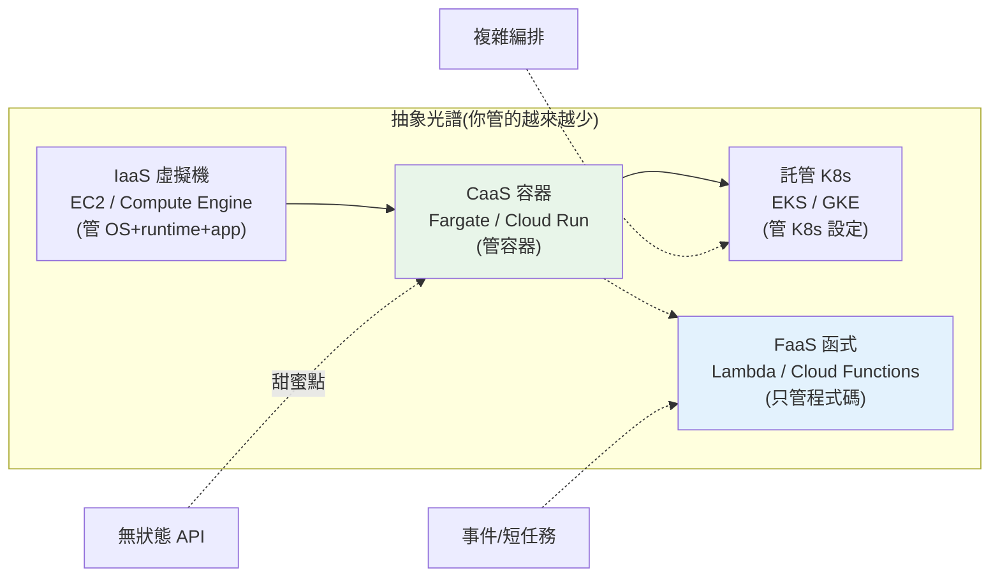

# 雲端部署概論與 AWS/GCP 對照

> [Part 19](../19-cloud-native/README.md) 教你把應用**容器化**、寫成 **12-factor**、跑在 **Kubernetes** 上——這些都是**廠商中立**的。但真要上線,你得選一朵雲、用它的具體服務。**AWS 和 GCP 是兩大主流**,概念相通但名稱、介面各異。這章建立**部署模型的心智地圖**(IaaS/CaaS/FaaS 怎麼選)與 **AWS ↔ GCP 服務對照表**——讓你不被單一雲綁死,理解一個概念在兩雲各叫什麼、何時用哪種部署模型。

## Why(為什麼)

學會 Docker/K8s 之後,面對真實雲平台仍會卡住——因為:

- **服務多到眼花、名稱各異**:AWS 有 200+ 服務,GCP 也有上百個。「我要跑一個容器」在 AWS 是 ECS/Fargate、在 GCP 是 Cloud Run;「我要一個資料庫」是 RDS / Cloud SQL。**同一個需求,兩雲的服務名完全不同**,不對照就會迷路。
- **部署模型有好幾種,選錯很貴**:同一個 Python 應用,可以跑在**虛擬機、容器、Kubernetes、或 serverless 函式**上——每種的成本、維運負擔、擴展性、冷啟動特性都不同。選錯(如把簡單 API 硬上 K8s、或把長任務放 serverless)會**過度複雜或效能不彰**。
- **廠商鎖定(vendor lock-in)的風險**:用了某雲的專屬服務(如 AWS 的 DynamoDB、GCP 的 BigQuery),就難搬到另一雲。**理解「哪些是通用概念、哪些是專屬」**,能幫你做出「可攜 vs 便利」的取捨。

這章給你兩張地圖:**部署模型光譜**(從 IaaS 到 FaaS,維運負擔遞減、抽象遞增)和 **AWS ↔ GCP 服務對照**。有了它們,後面每一章的具體服務(容器、K8s、serverless、DB…)你都能**在兩雲間對照理解**,選型也有依據。這是上雲的第一張地圖。

## Theory(理論:部署模型光譜)

雲上跑應用有一條**抽象光譜**——越往右,你管的越少、雲管的越多:

```text
IaaS ──────── CaaS ──────── CaaS(K8s) ──────── FaaS
虛擬機         容器            託管 K8s            函式
你管 OS+       你管容器,       你管 K8s 設定,      你只管程式碼,
runtime+app    雲管主機         雲管節點            雲管一切
維運重 ←────────────────────────────────────→ 維運輕
控制多 ←────────────────────────────────────→ 控制少
```

| 模型 | 說明 | AWS | GCP | 適合 |
|------|------|-----|-----|------|
| **IaaS**(虛擬機) | 你拿到一台機器,自己裝 OS/runtime/app | EC2 | Compute Engine | 需完全控制、特殊環境、lift-and-shift |
| **CaaS**(無伺服器容器) | 給容器映像,雲跑它、自動擴縮 | ECS/Fargate | Cloud Run | **無狀態 HTTP 服務**(最常見) |
| **CaaS**(託管 K8s) | 雲管 K8s 控制平面,你部署工作負載 | EKS | GKE | 複雜編排、多服務、需 K8s 生態 |
| **FaaS**(函式) | 只上傳函式,事件觸發執行 | Lambda | Cloud Functions | **事件驅動、短任務、不定流量** |

**選型直覺**:

- **簡單無狀態 API** → **容器(Fargate / Cloud Run)**——最省心、自動擴縮、按用量計費。
- **事件驅動/短任務**(上傳觸發、排程、webhook)→ **serverless 函式**。
- **複雜多服務編排、需 K8s 生態** → **託管 K8s(EKS / GKE)**。
- **需完全控制 / 搬遷既有系統** → **虛擬機**。

## Specification(規範:AWS ↔ GCP 服務對照)

**核心服務對照**(後續各章詳述):

| 概念 | AWS | GCP |
|------|-----|-----|
| 虛擬機 | EC2 | Compute Engine |
| 無伺服器容器 | ECS / Fargate | **Cloud Run** |
| 託管 Kubernetes | EKS | GKE |
| 函式(FaaS) | Lambda | Cloud Functions |
| 容器映像庫 | ECR | Artifact Registry |
| 關聯式資料庫 | RDS | Cloud SQL |
| NoSQL | DynamoDB | Firestore / Bigtable |
| 物件儲存 | S3 | Cloud Storage(GCS) |
| 密鑰管理 | Secrets Manager | Secret Manager |
| 身分存取 | IAM | IAM |
| 監控 | CloudWatch | Cloud Monitoring |
| CDN | CloudFront | Cloud CDN |
| 負載平衡 | ELB / ALB | Cloud Load Balancing |
| 訊息佇列 | SQS / SNS | Pub/Sub |
| 資料倉儲 | Redshift | BigQuery |

**CLI 對照**:AWS 用 **`aws`** CLI、GCP 用 **`gcloud`** CLI。兩者都能用 [Terraform](08-iac-terraform.md) 以一致的方式管理(見 ch08)。

## Implementation(底層:通用 vs 專屬、按用量計費)

**哪些是「通用概念」、哪些是「廠商專屬」**:這關乎廠商鎖定。**通用的**(兩雲都有對等、且相容標準)——虛擬機、容器(Docker 映像到處跑)、Kubernetes(K8s API 標準,EKS/GKE 都遵循)、物件儲存(S3 API 幾乎是業界標準,GCS 也相容)、關聯式資料庫(都是標準 PostgreSQL/MySQL)。**專屬的**(綁定該雲、難搬)——DynamoDB、BigQuery、各家的 serverless 執行環境細節、IAM 的具體模型。**原則:核心邏輯用通用服務(容器 + 標準 DB),需要專屬服務時明知取捨(便利 vs 可攜)**。這也是為什麼 [Part 19 教廠商中立的 Docker/K8s](../19-cloud-native/README.md)——那些技能在兩雲都通用,是「可攜」的地基。

**雲的計費本質:按用量(pay-as-you-go)**。傳統自建機房是**固定成本**(買機器、養機房);雲是**變動成本**——用多少算多少(EC2 按秒、Lambda 按呼叫次數 + 執行時間、S3 按儲存量 + 傳輸)。這帶來彈性(不用預先買硬體)但也帶來**成本失控風險**(見 [ch10](10-observability-cost.md))——一個沒設上限的自動擴縮、或忘了關的資源,帳單會爆。**serverless 尤其**——「不用不花錢」很誘人,但高流量下可能比固定容量貴。理解計費模型是雲上省錢的前提。

**為何 CaaS(Fargate/Cloud Run)是多數 Python 服務的甜蜜點**:它結合了容器的可攜(Docker 映像)+ serverless 的免維運(不管主機、自動擴縮、按用量計費),又沒有 FaaS 的限制(冷啟動、執行時間上限、狀態限制)。對「一個 [FastAPI](../14-web/README.md) 無狀態服務」,Fargate/Cloud Run 通常是最省心的選擇(見 [ch03](03-containers-ecs-cloudrun.md))。下面範例實作服務對照查詢與部署模型選型。

## Code Example(可執行的 Python 範例)

```python
# cloud_overview.py — AWS/GCP 服務對照 + 部署模型選型(純標準庫)
from __future__ import annotations

# 概念 → (AWS 服務, GCP 服務)
SERVICE_MAP: dict[str, tuple[str, str]] = {
    "vm-iaas": ("EC2", "Compute Engine"),
    "container-caas": ("ECS/Fargate", "Cloud Run"),
    "managed-k8s": ("EKS", "GKE"),
    "function-faas": ("Lambda", "Cloud Functions"),
    "sql-db": ("RDS", "Cloud SQL"),
    "object-storage": ("S3", "Cloud Storage"),
    "secrets": ("Secrets Manager", "Secret Manager"),
    "registry": ("ECR", "Artifact Registry"),
    "monitoring": ("CloudWatch", "Cloud Monitoring"),
}


def equivalent(service: str) -> tuple[str | None, str | None]:
    """給任一雲的服務名,查另一雲的對應。回 (概念, 另一雲服務)。"""
    s = service.lower()
    for concept, (aws, gcp) in SERVICE_MAP.items():
        if s in aws.lower():
            return concept, gcp
        if s in gcp.lower():
            return concept, aws
    return None, None


def recommend_model(needs: dict[str, bool]) -> str:
    """依需求推薦部署模型。"""
    if needs.get("event_driven") and needs.get("short_tasks"):
        return "serverless 函式(Lambda / Cloud Functions)"
    if needs.get("stateless_http") and not needs.get("complex_orchestration"):
        return "容器(Fargate / Cloud Run)"
    if needs.get("complex_orchestration"):
        return "託管 K8s(EKS / GKE)"
    return "虛擬機(EC2 / Compute Engine)"


def main() -> None:
    print("跨雲服務對照查詢:")
    for svc in ["Lambda", "Cloud Run", "S3"]:
        concept, other = equivalent(svc)
        print(f"  {svc} → 概念[{concept}] → 另一雲對應: {other}")

    print("\n部署模型選型:")
    cases = [
        ("圖片上傳觸發縮圖", {"event_driven": True, "short_tasks": True}),
        ("FastAPI 無狀態 API", {"stateless_http": True}),
        ("多服務微服務系統", {"complex_orchestration": True}),
    ]
    for name, needs in cases:
        print(f"  {name}: {recommend_model(needs)}")


if __name__ == "__main__":
    main()
```

**預期輸出**:

```pycon
$ python cloud_overview.py
跨雲服務對照查詢:
  Lambda → 概念[function-faas] → 另一雲對應: Cloud Functions
  Cloud Run → 概念[container-caas] → 另一雲對應: ECS/Fargate
  S3 → 概念[object-storage] → 另一雲對應: Cloud Storage

部署模型選型:
  圖片上傳觸發縮圖: serverless 函式(Lambda / Cloud Functions)
  FastAPI 無狀態 API: 容器(Fargate / Cloud Run)
  多服務微服務系統: 託管 K8s(EKS / GKE)
```

逐段解說:

- **服務對照查詢**:給 AWS 的 `Lambda`,查到概念是 function-faas、GCP 對應是 `Cloud Functions`;給 GCP 的 `Cloud Run`,查到 AWS 對應 `ECS/Fargate`。**這種「概念對照」是跨雲工作的核心**——你懂了一個概念,在兩雲間就能對映(不必重學)。
- **部署模型選型**:同樣是 Python 應用,依需求推薦不同模型——**事件驅動短任務**(縮圖)→ serverless、**無狀態 API**(FastAPI)→ 容器(甜蜜點)、**多服務編排** → K8s。這把「該用哪種部署」變成可判斷的規則,而非拍腦袋。
- **實務意義**:真實決策更複雜(還要考慮團隊熟悉度、既有基礎設施、成本、合規),但這個框架抓住了主軸——**用抽象光譜(IaaS→FaaS)配對需求**。多數新的 Python 無狀態服務,答案是**容器(Fargate/Cloud Run)**。
- **要點**:雲上有部署模型光譜(IaaS→CaaS→K8s→FaaS,維運遞減);AWS↔GCP 服務名不同但概念相通;用「需求→模型」框架選型,無狀態 API 首選容器。

## Diagram(圖解:部署模型光譜)



## Best Practice(最佳實踐)

- **用「需求 → 部署模型」選型**:無狀態 API → 容器、事件/短任務 → serverless、複雜編排 → K8s、需完全控制 → VM。
- **無狀態 Python 服務首選 CaaS(Fargate/Cloud Run)**:可攜 + 免維運 + 自動擴縮 + 按用量,無 FaaS 的限制。
- **核心用通用服務(容器 + 標準 DB)**:降低廠商鎖定,能在兩雲間遷移。
- **用專屬服務時明知取捨**:DynamoDB/BigQuery 很好用但綁定該雲——便利 vs 可攜要想清楚。
- **建立 AWS↔GCP 對照心智**:懂概念就能跨雲,不必重學。
- **理解按用量計費**:彈性但要防成本失控([ch10](10-observability-cost.md)),設預算與告警。
- **[Part 19 的 Docker/K8s 技能是可攜地基](../19-cloud-native/README.md)**:那些在兩雲都通用。
- **多雲不是預設**:除非有明確理由(避鎖定、合規、可用性),否則單雲更簡單;先精通一朵。

## Common Mistakes(常見誤解)

- **簡單 API 硬上 K8s**:過度複雜、維運重;容器(Fargate/Cloud Run)通常就夠。
- **長任務/大狀態放 serverless**:撞執行時間上限、冷啟動、狀態限制。
- **無腦用專屬服務**:綁死單一雲,日後難搬還不自知。
- **不懂計費就開自動擴縮**:成本失控(忘了設上限、忘了關資源)。
- **以為兩雲差很多**:概念相通,學會對照就能跨;別重頭學。
- **一開始就追多雲**:複雜度爆炸;先精通一朵雲。
- **把 lift-and-shift(搬 VM 上雲)當雲原生**:只是換地方跑,沒享受到雲的彈性/託管。
- **忽略團隊熟悉度**:技術選型也要看團隊會什麼,別只看技術優劣。

## Interview Notes(面試重點)

- **能講部署模型光譜**:IaaS→CaaS→K8s→FaaS,維運負擔遞減、抽象遞增,並依需求選型。
- **能做 AWS↔GCP 對照**:EC2/Compute Engine、Fargate/Cloud Run、EKS/GKE、Lambda/Cloud Functions、RDS/Cloud SQL、S3/GCS。
- **能講為何無狀態服務首選容器(Fargate/Cloud Run)**:可攜 + 免維運 + 自動擴縮,無 FaaS 限制。
- **能講廠商鎖定的取捨**:通用服務(容器/標準 DB)可攜 vs 專屬服務(DynamoDB/BigQuery)便利但綁定。
- **能講按用量計費的彈性與風險**:不用預購硬體 vs 成本失控要設上限。
- **知道多雲不是預設**、Docker/K8s 是可攜地基。

---

➡️ 下一章:[IAM:身分與存取管理](02-iam.md)

[⬆️ 回 Part 31 索引](README.md)
