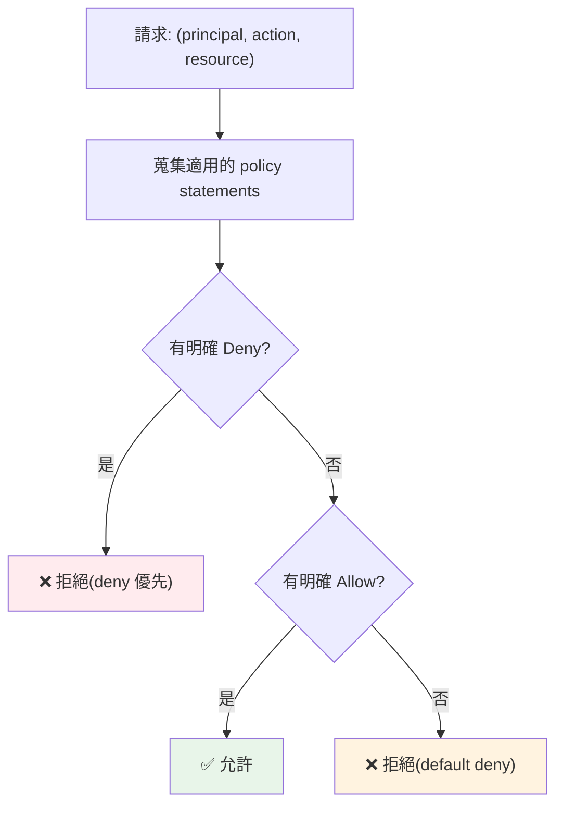

# IAM:身分與存取管理

> 上雲第一件會踩的事,幾乎都跟 **IAM(Identity and Access Management,身分與存取管理)** 有關——「權限不足跑不動」或「權限太大出事」。IAM 是雲的**安全地基**:誰(identity)能對哪個資源(resource)做什麼動作(action)。這章講清楚 **principal / policy / permission** 模型、**最小權限原則**、以及 **AWS IAM ↔ GCP IAM** 的關鍵差異(AWS 是「政策附加到身分」、GCP 是「角色綁定到資源」),並用純 Python 實作一個權限判斷器,讓你理解 allow/deny 是怎麼算出來的。

## Why(為什麼)

沒有 IAM,雲就是**全有或全無**——要嘛誰都能刪你的資料庫,要嘛沒人能用。真實情況需要**細粒度、可稽核**的存取控制:

- **最小權限(least privilege)是資安底線**:一個被盜的憑證、一段被注入的程式碼,能造成多大損害,取決於它有多少權限。給 CI 部署用的身分**只該有部署所需的權限**,不該能讀取所有客戶資料。權限開太大 = 把攻擊面放到最大。
- **人與機器都要身分**:不只「工程師登入 console」要身分,**你的應用程式讀 S3、CI 部署到 Cloud Run、Lambda 呼叫資料庫**——每個都需要一個身分與對應權限。搞懂 IAM 才能讓服務彼此安全地呼叫。
- **雲上最常見的資安事故就是 IAM 配錯**:公開的 S3 bucket、over-privileged 的角色、寫死在程式裡的長期金鑰——這些是資料外洩的頭號原因。理解 IAM 模型,才能避開這些坑。
- **兩雲模型不同會混淆**:AWS 把 policy **附加到 identity**(user/role);GCP 把 role **綁定到 resource**(透過 IAM binding)。不理解差異,從一雲換到另一雲會困惑。

這章讓你能回答:「這個身分能不能做這個動作?」——並知道怎麼設計權限,讓服務能運作、又不過度授權。

## Theory(理論:IAM 的三要素)

所有雲的 IAM 都圍繞三個核心概念:

```text
Principal(誰) ── 被授予 ──> Permission(能做什麼) ── 作用於 ──> Resource(哪個資源)
    │                            │                              │
  身分:                       動作:                         對象:
  - 使用者(人)              - s3:GetObject                - 特定 bucket
  - 服務帳號(機器)          - ec2:StartInstances          - 特定 VM
  - 角色(可被扮演)          - run.services.invoke         - 特定服務
```

- **Principal(主體 / 身分)**:發起請求的實體。分兩類——**人類使用者**(工程師)與**機器身分**(應用/服務,AWS 叫 **role**、GCP 叫 **service account**)。
- **Permission / Action(權限 / 動作)**:一個可被允許或拒絕的操作,如 `s3:GetObject`(讀 S3 物件)、`run.services.invoke`(呼叫 Cloud Run 服務)。
- **Resource(資源)**:動作作用的對象,如某個 bucket、某台 VM。
- **Policy(政策)**:把「principal + action + resource + 允許/拒絕」綁在一起的規則文件。

**授權判斷**:一個請求 =(principal, action, resource)。IAM 引擎查所有適用的 policy,決定 **allow 還是 deny**。核心原則:**預設拒絕(default deny)**——沒有明確允許就是拒絕;且**明確 deny 勝過 allow**。

## Specification(規範:AWS IAM vs GCP IAM)

兩雲模型的**關鍵差異**——政策附加的方向相反:

| 面向 | AWS IAM | GCP IAM |
|------|---------|---------|
| **機器身分** | IAM Role | Service Account |
| **權限集合** | Policy(JSON,含 Statement) | Role(預定義 / 自訂,含 permissions) |
| **綁定方向** | Policy **附加到 identity**(user/role) | Role **綁定到 resource**(IAM binding) |
| **綁定語意** | 「這個身分能做什麼」 | 「這個資源上,誰有什麼角色」 |
| **角色扮演** | `sts:AssumeRole`(切換身分) | Service Account impersonation |
| **層級** | Account → IAM | Organization → Folder → Project → Resource(**繼承**) |

**AWS policy(JSON)範例**:

```json
{
  "Version": "2012-10-17",
  "Statement": [{
    "Effect": "Allow",
    "Action": ["s3:GetObject", "s3:PutObject"],
    "Resource": "arn:aws:s3:::my-bucket/*"
  }]
}
```

**GCP IAM binding 範例**(綁在 resource/project 上):

```yaml
bindings:
  - role: roles/run.invoker
    members:
      - serviceAccount:my-app@my-project.iam.gserviceaccount.com
```

**心智轉換**:AWS 問「這個 **role** 有哪些 policy?」;GCP 問「這個 **resource** 上有哪些 role binding?」——同樣的目的,思考起點不同。

## Implementation(底層:授權怎麼算、角色扮演)

**授權評估流程(以 AWS 為例,GCP 概念類似)**:

1. **預設拒絕**:一切從 deny 開始。
2. **蒐集適用 policy**:找出所有作用於此 (principal, action, resource) 的 statement。
3. **明確 deny 優先**:任一 statement 明確 `Deny` → 立即拒絕(deny 無法被 allow 覆蓋)。
4. **需要明確 allow**:至少一個 statement `Allow` 才通過;否則(隱含)拒絕。

這個「**default deny + explicit deny 優先**」是雲 IAM 的通則——它讓安全**預設安全(secure by default)**:忘了設就是不給,而非給太多。

**機器身分與角色扮演——為何重要**:應用程式**不該**用寫死的長期金鑰(access key)。正確做法是讓它**取得一個 role/service account 身分**:

- **AWS**:EC2/ECS/Lambda 掛一個 **IAM Role**,SDK 自動取得**臨時憑證**(短期、自動輪替),經 `AssumeRole` 換發。
- **GCP**:Compute/Cloud Run 掛一個 **Service Account**,取得臨時 token。

**為何用臨時憑證而非長期金鑰**:長期金鑰**外洩就長期有效**(要手動輪替、常被寫死在程式或環境變數裡忘記);臨時憑證**短命 + 自動輪替**,洩漏的損害窗口小。這也是 [ch09 CI/CD 用 OIDC 免金鑰](09-cicd-to-cloud.md) 的基礎——CI 用聯合身分換臨時憑證,不存任何長期金鑰。下面實作一個授權判斷器,呈現 default-deny 與 explicit-deny 邏輯。

## Code Example(可執行的 Python 範例)

```python
# iam.py — 簡化版 IAM 授權引擎(default deny + explicit deny 優先)
from __future__ import annotations

from dataclasses import dataclass, field
from enum import Enum


class Effect(Enum):
    ALLOW = "Allow"
    DENY = "Deny"


@dataclass(frozen=True)
class Statement:
    effect: Effect
    actions: frozenset[str]  # 支援萬用字元,如 "s3:*"
    resources: frozenset[str]


@dataclass
class Policy:
    statements: list[Statement] = field(default_factory=list)


def _matches(pattern: str, value: str) -> bool:
    """支援尾綴萬用字元:'s3:*' 匹配 's3:GetObject';'*' 匹配全部。"""
    if pattern == "*":
        return True
    if pattern.endswith("*"):
        return value.startswith(pattern[:-1])
    return pattern == value


def _statement_applies(stmt: Statement, action: str, resource: str) -> bool:
    action_ok = any(_matches(a, action) for a in stmt.actions)
    resource_ok = any(_matches(r, resource) for r in stmt.resources)
    return action_ok and resource_ok


def authorize(policy: Policy, action: str, resource: str) -> bool:
    """回傳是否允許。規則:default deny、explicit deny 勝過 allow。"""
    allowed = False
    for stmt in policy.statements:
        if not _statement_applies(stmt, action, resource):
            continue
        if stmt.effect is Effect.DENY:
            return False  # explicit deny 立即拒絕
        allowed = True
    return allowed  # 需至少一個 allow,否則預設拒絕


def main() -> None:
    # 一個部署用身分:能讀寫特定 bucket,但明確禁止刪除
    policy = Policy([
        Statement(Effect.ALLOW, frozenset({"s3:GetObject", "s3:PutObject"}),
                  frozenset({"arn:aws:s3:::app-bucket/*"})),
        Statement(Effect.DENY, frozenset({"s3:DeleteObject"}),
                  frozenset({"arn:aws:s3:::app-bucket/*"})),
    ])

    checks = [
        ("s3:GetObject", "arn:aws:s3:::app-bucket/file.txt"),      # allow
        ("s3:PutObject", "arn:aws:s3:::app-bucket/new.txt"),       # allow
        ("s3:DeleteObject", "arn:aws:s3:::app-bucket/file.txt"),   # explicit deny
        ("s3:GetObject", "arn:aws:s3:::other-bucket/x"),           # 未授權 -> default deny
        ("ec2:StartInstances", "*"),                               # 未授權 -> default deny
    ]
    for action, resource in checks:
        verdict = "ALLOW" if authorize(policy, action, resource) else "DENY "
        print(f"  [{verdict}] {action} on {resource}")


if __name__ == "__main__":
    main()
```

**預期輸出**:

```pycon
$ python iam.py
  [ALLOW] s3:GetObject on arn:aws:s3:::app-bucket/file.txt
  [ALLOW] s3:PutObject on arn:aws:s3:::app-bucket/new.txt
  [DENY ] s3:DeleteObject on arn:aws:s3:::app-bucket/file.txt
  [DENY ] s3:GetObject on arn:aws:s3:::other-bucket/x
  [DENY ] ec2:StartInstances on *
```

逐段解說:

- **`Statement`**:一條規則——effect(允許/拒絕)+ actions + resources。這對應 AWS policy 的 Statement,也是 GCP role 的概念抽象。
- **`_matches` 萬用字元**:真實 IAM 支援 `s3:*` 這種前綴萬用——這正是**權限容易開太大**的地方(`"*"` 匹配一切 = 管理員權限)。
- **`authorize` 的核心邏輯**:先假設 `allowed = False`(**default deny**);遇到 explicit `Deny` 立即回 `False`(**deny 優先**);要有至少一個 `Allow` 才放行。**這三行程式碼濃縮了雲 IAM 的授權模型**。
- **輸出解讀**:讀寫 app-bucket 放行;刪除被 explicit deny 擋下(即使沒有 deny,它也不在 allow 清單→本來就拒);讀別的 bucket、開 EC2 都因為**沒有明確 allow** 而 default deny。
- **要點**:IAM = (principal, action, resource) → allow/deny;**預設拒絕、明確 deny 優先**;真實系統加上條件(來源 IP、MFA、時間)、資源層級與繼承,但核心判斷邏輯就是這樣。

## Diagram(圖解:授權評估流程)



## Best Practice(最佳實踐)

- **最小權限(least privilege)**:只給完成任務所需的最小權限;寧可不足再補,不要一開始就給 `*`。
- **用 role/service account,不用長期金鑰**:應用/CI 掛角色取得**臨時憑證**,別把 access key 寫進程式或環境變數([ch09 用 OIDC](09-cicd-to-cloud.md))。
- **一個工作負載一個身分**:每個服務給專屬 role/SA,權限隔離、稽核清楚,出事影響面小。
- **善用預定義角色再逐步收斂**:先用雲的 managed/predefined role 起步,再依實際用量裁減成自訂角色。
- **明確 deny 護欄**:對高風險動作(刪除、改權限)加 explicit deny 或 SCP/組織政策當保險。
- **定期稽核與輪替**:檢視誰有什麼權限、移除未使用權限、輪替任何殘留的金鑰。
- **AWS 想「身分有什麼 policy」、GCP 想「資源上有誰的 role」**:用對心智模型。
- **絕不把憑證進版控**:用密鑰管理([ch07](07-secrets-config-network.md)),`.gitignore` 憑證檔。

## Common Mistakes(常見誤解)

- **用 `"*"` 圖方便**:等於給管理員權限,攻擊面最大;被盜就滿盤皆輸。
- **把長期 access key 寫死在程式/環境變數**:外洩就長期有效,是頭號外洩來源;用臨時憑證。
- **所有服務共用一個超級身分**:無法隔離、無法稽核、一處失守全盤皆輸。
- **以為 deny 可被 allow 覆蓋**:相反——**explicit deny 永遠優先**。
- **忘了 default deny**:沒明確允許就是拒絕;「跑不動」常常只是少了一條 allow。
- **公開 bucket 沒察覺**:S3/GCS 誤設公開讀是經典外洩;預設關閉公開存取。
- **混淆兩雲模型**:AWS policy 附到身分、GCP role 綁到資源;硬套會困惑。
- **給人而非給角色**:用群組/角色管理權限,別逐一給每個使用者,否則無法維護。

## Interview Notes(面試重點)

- **能講 IAM 三要素**:principal(誰)、action/permission(做什麼)、resource(對哪個),以 policy 綁定。
- **能講授權評估**:default deny + explicit deny 優先 + 需明確 allow。
- **能講最小權限為何是資安底線**:限制被盜憑證/被注入程式的損害範圍。
- **能講為何用臨時憑證而非長期金鑰**:短命 + 自動輪替,洩漏窗口小;對應 [OIDC 免金鑰 CI](09-cicd-to-cloud.md)。
- **能對照 AWS/GCP**:role vs service account、policy 附到身分 vs role 綁到資源、AssumeRole vs impersonation。
- **能舉常見事故**:公開 bucket、over-privileged role、寫死金鑰。

---

➡️ 下一章:[容器部署:ECS/Fargate vs Cloud Run](03-containers-ecs-cloudrun.md)

[⬆️ 回 Part 31 索引](README.md)
