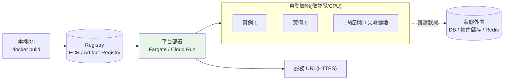

# 容器部署:ECS/Fargate vs Cloud Run

> 你已經把 [task-api 容器化](../19-cloud-native/README.md)(有一個 Docker 映像)。**最省心的上雲方式**,就是把這個映像交給雲的**無伺服器容器平台**——AWS 的 **ECS/Fargate** 或 GCP 的 **Cloud Run**——它幫你跑、自動擴縮、按用量計費,你不用管任何主機。這是 [ch01 部署模型光譜](01-cloud-overview.md) 裡對多數 Python 無狀態服務的「甜蜜點」。這章講清楚容器部署的完整流程(build → push registry → deploy)、兩平台的差異與選型,並用 Python 實作一個「部署就緒度」檢查與擴縮估算。

## Why(為什麼)

有了 Docker 映像,為什麼不直接開台 VM 自己跑?因為那要你**自己管一堆事**:

- **VM 要自己維運**:裝 Docker、開機自啟、監控、修補 OS、處理當機重啟、手動擴縮……這些都是**與業務無關的重複勞動**。無伺服器容器平台把這些全接手。
- **流量會變動**:半夜沒人用、白天尖峰。VM 是**固定容量**——養著尖峰的規格,離峰就在燒錢;不夠又會掛。無伺服器容器**自動擴縮**(含 Cloud Run 可**縮到零**),按實際用量計費。
- **要能快速、安全地發新版**:手動 SSH 上去換映像、重啟,容易出錯又沒有回滾。平台提供**版本化部署、流量切換、一鍵回滾**。
- **從 Docker 到「線上服務」還缺幾步**:映像要放進雲的 **registry**、要設環境變數/密鑰、要開對外埠、要設健康檢查、要調 CPU/記憶體——這章補齊這條路。

**結論**:對「一個無狀態 HTTP 服務(如 FastAPI task-api)」,Fargate / Cloud Run 讓你**用最少維運換到自動擴縮的線上服務**——這是多數團隊上雲的第一站。

## Theory(理論:無伺服器容器的部署流程)

從本機映像到線上服務,通用三步:

```text
1. Build     docker build -t task-api .        本機/CI 建映像
       ↓
2. Push      推到雲的容器映像庫(registry)
             AWS: ECR    GCP: Artifact Registry
       ↓
3. Deploy    平台拉映像、跑容器、給一個 URL
             AWS: ECS/Fargate service   GCP: Cloud Run service
             ↑ 自動擴縮、健康檢查、滾動更新、流量切換
```

**無伺服器容器(serverless container)的特性**:

- **你只給映像 + 設定**(CPU/記憶體、環境變數、埠、擴縮範圍),平台管主機。
- **自動擴縮**:依請求量/CPU 增減實例數。**Cloud Run 可縮到零**(沒流量不收錢,但有冷啟動);Fargate 也能配置 auto scaling。
- **按用量計費**:大致按「實例規格 × 執行時間」,離峰省錢。
- **無狀態假設**:實例隨時被建立/銷毀——**狀態必須外置**(DB、[物件儲存 ch06](06-managed-db-storage.md)、快取),別存本機磁碟或記憶體。

## Specification(規範:ECS/Fargate vs Cloud Run)

| 面向 | AWS ECS/Fargate | GCP Cloud Run |
|------|-----------------|---------------|
| **定位** | 無伺服器容器編排 | 無伺服器容器(更簡單) |
| **映像庫** | ECR | Artifact Registry |
| **設定單位** | Task Definition(JSON)+ Service | Service(一條 `gcloud run deploy`) |
| **縮到零** | 否(最少 1 實例,除非配 App Runner) | **是**(預設可縮到零) |
| **冷啟動** | 少(常駐) | 有(縮到零後首請求) |
| **計費粒度** | 每秒(實例規格) | 每 100ms(僅處理請求時) |
| **上手複雜度** | 較高(cluster/task/service 概念多) | **低**(一行指令部署) |
| **底層** | 跑在 ECS(也可搭 EC2 模式) | 跑在 Knative/GKE 之上(全託管) |
| **適合** | 已在 AWS 生態、需精細控制 | 快速部署、流量波動大、成本敏感 |

**部署指令對照**(示意):

```bash
# AWS:build → push ECR → 更新 ECS service
aws ecr get-login-password | docker login --username AWS --password-stdin <acct>.dkr.ecr.<region>.amazonaws.com
docker build -t <acct>.dkr.ecr.<region>.amazonaws.com/task-api:v1 .
docker push <acct>.dkr.ecr.<region>.amazonaws.com/task-api:v1
aws ecs update-service --cluster prod --service task-api --force-new-deployment

# GCP:一行搞定(build + push + deploy)
gcloud run deploy task-api --source . --region asia-east1 --allow-unauthenticated
```

> Cloud Run 的 `--source .` 甚至可以**免寫 Dockerfile**(用 buildpacks 自動偵測),或用你既有的 Dockerfile。這是它「最簡單」的體現。

## Implementation(底層:擴縮、冷啟動、無狀態)

**自動擴縮怎麼運作**:平台監控指標(並發請求數 / CPU),超過閾值就**加實例**、低於就**減**。Cloud Run 以**每實例並發數(concurrency)** 為核心——一個實例可同時處理 N 個請求(預設 80),`需要的實例數 ≈ 尖峰並發請求 / concurrency`。這也是為什麼 **async I/O-bound 服務([FastAPI](../14-web/README.md))在單實例能扛更多並發** → 更省。

**冷啟動(cold start)的取捨**:縮到零省錢,但**下一個請求要等實例冷啟動**(拉映像、起 runtime、初始化)——對延遲敏感的服務是痛點。緩解:設**最小實例數(min instances)** 保溫(犧牲一點省錢換低延遲)、縮小映像、加快啟動(延遲載入重物件)。**Fargate 常駐無此問題但也不縮到零**——這是兩平台的核心取捨。

**無狀態是硬需求**:實例隨時被殺/新建、水平多份——所以:

- **不能存本機**:上傳檔案存 [物件儲存(S3/GCS)](06-managed-db-storage.md),不是容器磁碟。
- **不能靠記憶體存 session**:狀態放外部(DB/Redis)。
- **設定/密鑰從環境注入**:遵循 [12-factor](../19-cloud-native/README.md),經環境變數 + [密鑰管理 ch07](07-secrets-config-network.md)。
- **健康檢查**:提供 `/health` 端點,平台據此判斷實例好壞、決定是否送流量。

下面用 Python 實作部署就緒度檢查與擴縮估算,把這些原則變成可驗證的規則。

## Code Example(可執行的 Python 範例)

```python
# containers.py — 部署就緒度檢查 + Cloud Run 式擴縮估算(純標準庫)
from __future__ import annotations

import math
from dataclasses import dataclass


@dataclass
class ServiceConfig:
    has_dockerfile: bool
    listens_on_port_env: bool   # 讀 $PORT,而非寫死埠
    stateless: bool             # 狀態外置(無本機磁碟依賴)
    health_endpoint: bool       # 有 /health
    secrets_from_env: bool      # 密鑰由環境注入,非寫死
    cpu: float                  # vCPU
    memory_mb: int


def readiness_check(cfg: ServiceConfig) -> list[str]:
    """回傳未就緒的問題清單;空清單代表可安全部署。"""
    problems: list[str] = []
    if not cfg.has_dockerfile:
        problems.append("缺 Dockerfile / buildpack 來源")
    if not cfg.listens_on_port_env:
        problems.append("未讀取 $PORT(平台注入的埠)")
    if not cfg.stateless:
        problems.append("非無狀態:狀態需外置到 DB/物件儲存")
    if not cfg.health_endpoint:
        problems.append("缺 /health 健康檢查端點")
    if not cfg.secrets_from_env:
        problems.append("密鑰寫死:應由環境/密鑰管理注入")
    if cfg.memory_mb < 256:
        problems.append("記憶體過低(<256MB)易 OOM")
    return problems


def estimate_instances(peak_rps: float, avg_latency_s: float,
                       concurrency: int) -> int:
    """估尖峰所需實例數。
    Little's Law:在途請求 = 到達率 × 停留時間;
    需要的實例 = ceil(在途請求 / 每實例並發).
    """
    in_flight = peak_rps * avg_latency_s
    return max(1, math.ceil(in_flight / concurrency))


def main() -> None:
    good = ServiceConfig(
        has_dockerfile=True, listens_on_port_env=True, stateless=True,
        health_endpoint=True, secrets_from_env=True, cpu=1.0, memory_mb=512,
    )
    bad = ServiceConfig(
        has_dockerfile=True, listens_on_port_env=False, stateless=False,
        health_endpoint=False, secrets_from_env=True, cpu=1.0, memory_mb=128,
    )

    print("就緒的服務:", readiness_check(good) or "OK,可部署")
    print("有問題的服務:")
    for p in readiness_check(bad):
        print(f"  - {p}")

    print("\n擴縮估算(concurrency=80):")
    for rps in (10, 100, 500):
        n = estimate_instances(peak_rps=rps, avg_latency_s=0.2, concurrency=80)
        print(f"  尖峰 {rps} rps, 延遲 0.2s -> 約需 {n} 個實例")


if __name__ == "__main__":
    main()
```

**預期輸出**:

```pycon
$ python containers.py
就緒的服務: OK,可部署
有問題的服務:
  - 未讀取 $PORT(平台注入的埠)
  - 非無狀態:狀態需外置到 DB/物件儲存
  - 缺 /health 健康檢查端點
  - 記憶體過低(<256MB)易 OOM

擴縮估算(concurrency=80):
  尖峰 10 rps, 延遲 0.2s -> 約需 1 個實例
  尖峰 100 rps, 延遲 0.2s -> 約需 1 個實例
  尖峰 500 rps, 延遲 0.2s -> 約需 2 個實例
```

逐段解說:

- **`readiness_check`**:把「上雲前該檢查的事」變成規則——讀 `$PORT`(平台動態指派埠,寫死會綁不上)、無狀態、`/health`、密鑰不寫死、記憶體夠。**部署失敗十之八九是這幾條沒過**。
- **`estimate_instances` 用 Little's Law**:在途請求數 = 到達率 × 停留時間(`peak_rps × latency`),再除以每實例並發。這解釋了為什麼**低延遲 + 高並發**的服務用很少實例就能扛大流量——500 rps × 0.2s = 100 在途,concurrency 80 → 只需 2 實例。
- **async 的價值再現**:若服務是同步阻塞、concurrency 只能設 1,同樣 500 rps 就要 100 個實例——**I/O-bound 用 async 提高單實例並發 = 直接省成本**(呼應 [Part 09 併發/asyncio](../09-concurrency/README.md))。
- **要點**:容器上雲 = build→push registry→deploy;無伺服器容器自動擴縮、按用量;無狀態是硬需求;用並發模型估實例數。

## Diagram(圖解:build → push → deploy → 擴縮)



## Best Practice(最佳實踐)

- **無狀態服務首選無伺服器容器(Fargate/Cloud Run)**:最少維運換自動擴縮線上服務。
- **狀態一律外置**:上傳存[物件儲存](06-managed-db-storage.md)、session/快取存 Redis、資料進 [DB](06-managed-db-storage.md);容器磁碟當暫存。
- **讀 `$PORT`、提供 `/health`**:平台指派埠與健康檢查是部署基本盤。
- **密鑰/設定從環境注入**:遵循 [12-factor](../19-cloud-native/README.md),接 [密鑰管理](07-secrets-config-network.md)。
- **小映像、快啟動**:多階段 build、slim base image;縮到零時冷啟動更快。
- **延遲敏感就設 min instances**:犧牲一點省錢換掉冷啟動延遲。
- **版本化 tag(非 `latest`)+ 流量切換**:可回滾、可金絲雀([ch09](09-cicd-to-cloud.md))。
- **用並發模型調 concurrency 與資源**:async I/O-bound 服務調高 concurrency 省實例。
- **選型**:要簡單/波動大/縮到零 → Cloud Run;已在 AWS 生態/需精細控制 → ECS/Fargate。

## Common Mistakes(常見誤解)

- **把狀態存本機磁碟/記憶體**:實例被殺就遺失、多實例不一致;必須外置。
- **寫死埠而非讀 `$PORT`**:平台指派的埠綁不上,部署起不來。
- **用 `latest` tag**:無法回滾、不知道線上跑哪版;用不可變版本 tag。
- **忽略冷啟動**:縮到零省錢但首請求慢;延遲敏感要設 min instances。
- **映像巨大**:拉映像慢、冷啟動久;用 slim + 多階段 build。
- **沒有 `/health`**:平台無法判斷實例好壞,可能把流量送給壞掉的實例。
- **把密鑰打進映像**:映像會被拉取/分享,等於外洩;用密鑰注入。
- **以為 Cloud Run/Fargate 適合長任務/背景工作**:它們以請求為中心;長任務用 [serverless job / 佇列](05-serverless.md) 或常駐 worker。

## Interview Notes(面試重點)

- **能講容器上雲流程**:build → push registry(ECR/Artifact Registry)→ deploy(Fargate/Cloud Run),平台管擴縮/健康檢查/滾動更新。
- **能對照 Fargate vs Cloud Run**:Cloud Run 更簡單、可縮到零(有冷啟動);Fargate 常駐、精細控制、在 AWS 生態。
- **能講無狀態為何是硬需求**:實例隨時建銷/多份,狀態必須外置。
- **能用並發模型估實例數**:Little's Law(在途 = rps × 延遲),async 提高並發省實例。
- **能講縮到零 vs 冷啟動的取捨**:min instances 換低延遲。
- **知道 12-factor 落地**:讀 `$PORT`、環境注入設定/密鑰、`/health`。

---

➡️ 下一章:[託管 Kubernetes:EKS vs GKE](04-managed-k8s.md)

[⬆️ 回 Part 31 索引](README.md)
