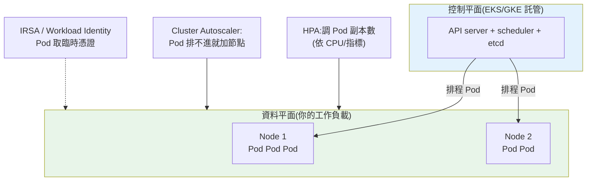

# 託管 Kubernetes:EKS vs GKE

> [Part 19 教你 Kubernetes 的概念](../19-cloud-native/README.md)(Pod、Deployment、Service、YAML)——那是**廠商中立**的。但**自己架一套 K8s 控制平面(control plane)極其痛苦**:etcd、API server、scheduler、憑證輪替、升級……幾乎沒人自己做。實務上你用**託管 K8s**——AWS 的 **EKS** 或 GCP 的 **GKE**——雲幫你顧控制平面,你只管工作負載。這章講清楚**何時才該用 K8s**(而非上一章更簡單的 Cloud Run/Fargate)、託管 K8s 的分工、EKS vs GKE 差異,並用 Python 實作副本數/資源排程的估算。

## 💡 白話導讀(建議先讀)

[Part 19 教過 Kubernetes 的概念](../19-cloud-native/06-kubernetes.md)(Pod、Deployment、Service)。
但**自己從零架一套 K8s 叢集**是惡夢——光是維護控制平面(那些讓叢集運作的大腦元件)
就能耗掉一個團隊。**託管 K8s**(AWS 的 **EKS**、GCP 的 **GKE**)就是來解決這件事的。

核心分工一句話:**雲幫你顧「大腦」,你只管「工人」**。

K8s 分兩塊:

- **控制平面(control plane)＝叢集的大腦**:API server、排程器、controller……
  這些又難又關鍵,一掛全掛。**託管 K8s 幫你顧好這塊,你完全不用碰**(還幫你自動更新、備援)。
- **資料平面(節點)＝幹活的工人**:實際跑你容器的機器。這塊還是你管
  (但雲也能幫你自動擴縮節點)。

那麼問題來了:**既然有 [Cloud Run](03-containers-ecs-cloudrun.md) 這麼省事,何必用 K8s?**
這章會誠實回答這個選型題。K8s 值得的時機是:
**你有很多個互相溝通的服務要編排**、需要**細緻的網路/資源控制**、
要跨雲一致性、或已有 K8s 生態(Helm、Istio、operator)。
如果只是**單一 web 服務**,Cloud Run 幾乎總是更好——**別為了履歷用 K8s**。

這章帶你把 task-api 部署到 GKE/EKS(對照 Cloud Run 版),
看清託管 K8s 幫你省了什麼、又留了哪些複雜度給你——
讓你有能力做出「該不該上 K8s」這個昂貴的架構決定。

## Why(為什麼)

上一章的 Cloud Run/Fargate 已經能跑容器、自動擴縮了,**為什麼還需要 K8s?** 因為當系統長大,會出現無伺服器容器不好處理的需求:

- **多服務、複雜編排**:十幾個微服務彼此呼叫、要統一的服務發現、流量治理、金絲雀/藍綠、批次任務 + 常駐服務 + 排程混合——K8s 提供**統一的編排平面**。
- **需要 K8s 生態**:Helm、Operator、Istio(service mesh)、Argo(GitOps/工作流)、Prometheus……許多成熟工具**以 K8s 為基座**。用了它們就得有 K8s。
- **可攜與一致**:K8s 是**業界標準 API**,EKS/GKE 都遵循同一套 YAML。**跨雲、跨地端的一致部署介面**——降低廠商鎖定(雖然雲專屬附加元件仍會綁)。
- **精細控制**:對資源配額、排程策略(node affinity、taint/toleration)、網路策略要精細掌控時,K8s 給你旋鈕。

**但要先潑冷水**:K8s **複雜、維運重、學習曲線陡**。[ch01](01-cloud-overview.md) 的選型原則沒變——**簡單無狀態服務別上 K8s**(Cloud Run/Fargate 就好)。K8s 是給「複雜度已經高到需要它」的系統。這章幫你判斷「何時值得」,並理解託管 K8s 幫你扛掉了什麼。

## Theory(理論:託管 K8s 的分工)

K8s 分**控制平面(control plane)** 與**資料平面(data plane / 節點)**。託管 K8s 的核心價值:**雲扛控制平面,你管工作負載**。

```text
┌─────────────────── 控制平面(雲託管,你不碰)───────────────────┐
│  API server · scheduler · controller-manager · etcd            │
│  → 高可用、自動升級、憑證輪替、備份 都由雲負責                    │
└────────────────────────────────────────────────────────────────┘
                              │ 管理
┌─────────────────── 資料平面(你的工作負載)─────────────────────┐
│  Node(VM/節點池)上跑你的 Pod(Deployment/Service/Job...)      │
│  → 你部署 YAML;節點可「自管」或交給雲「自動管」                  │
└────────────────────────────────────────────────────────────────┘
```

**節點管理的兩種模式**(遞增的「無伺服器」程度):

- **自管節點池(node pool)**:你選 VM 規格、決定節點數(或設 cluster autoscaler 自動增減)。要顧節點的修補/升級。
- **無伺服器節點**:**GKE Autopilot** / **EKS Fargate** ——連節點都不用管,只按 Pod 用量計費。更省心,但彈性與成本模型不同。

**你仍要負責的**:工作負載定義(Deployment/Service/Ingress YAML)、資源請求與限制(requests/limits)、自動擴縮設定(HPA)、應用層健康檢查、密鑰/設定。

## Specification(規範:EKS vs GKE)

| 面向 | AWS EKS | GCP GKE |
|------|---------|---------|
| **控制平面** | 託管(有小時費) | 託管(**Autopilot/標準**;有管理費,規模有免費額度政策) |
| **無伺服器節點** | EKS + Fargate | **GKE Autopilot**(業界最成熟) |
| **節點自動擴縮** | Cluster Autoscaler / Karpenter | Cluster Autoscaler(內建) |
| **上手/自動化程度** | 較手動(常搭 `eksctl`) | **較自動**(GKE 一向被視為最順的託管 K8s) |
| **映像庫** | ECR | Artifact Registry |
| **IAM 整合** | IRSA(IAM Roles for Service Accounts) | Workload Identity |
| **負載平衡** | AWS Load Balancer Controller → ALB/NLB | GKE Ingress → Cloud Load Balancing |
| **CLI** | `aws eks` + `eksctl` + `kubectl` | `gcloud container` + `kubectl` |

**共通點(可攜的部分)**:`kubectl`、YAML 資源定義、Helm、HPA、大部分生態工具——**這些兩雲一致**。差異主要在**叢集建立、節點管理、IAM 整合、負載平衡器**這些「與雲黏合」的邊界。

**建立叢集指令**(示意):

```bash
# AWS EKS(常用 eksctl 簡化)
eksctl create cluster --name prod --region ap-northeast-1 --nodes 3

# GCP GKE Autopilot(免管節點)
gcloud container clusters create-auto prod --region asia-east1

# 之後兩者都用一致的 kubectl 部署工作負載
kubectl apply -f deployment.yaml
```

## Implementation(底層:排程、資源請求、IAM 綁定)

**Pod 怎麼被排到節點上(scheduling)**:每個容器宣告 **requests**(保證取得的資源)與 **limits**(上限)。scheduler 找**剩餘可分配資源夠放下這個 Pod 的 requests** 的節點。**這是 K8s 資源模型的核心**——requests 決定排程與保證、limits 決定節流/OOM:

- **requests 設太高**:節點裝不下幾個 Pod → 浪費、成本高、可能排不進去(Pending)。
- **requests 設太低**:超賣、節點資源耗盡、Pod 被驅逐或效能抖動。
- **limits(記憶體)超過**:容器被 **OOMKilled**;CPU 超過則被**節流(throttle)**。

**自動擴縮的兩層**:

- **HPA(Horizontal Pod Autoscaler)**:依 CPU/自訂指標**增減 Pod 副本數**。
- **Cluster Autoscaler**:當 Pod 因資源不足排不進(Pending),**增加節點**;閒置就減。
- 兩者協作:HPA 加 Pod → 若節點不夠 → Cluster Autoscaler 加節點。

**Pod 如何安全存取雲資源(不用長期金鑰)**:這是託管 K8s 的關鍵整合——把 [ch02 的 IAM](02-iam.md) 綁到 K8s 的 service account:

- **EKS:IRSA**(IAM Roles for Service Accounts)——K8s SA 對映一個 IAM Role,Pod 取得臨時憑證。
- **GKE:Workload Identity**——K8s SA 對映 GCP Service Account。

**為何重要**:讓 Pod 用**臨時、最小權限**憑證存取 S3/GCS/DB,而非在 Secret 裡塞長期金鑰——延續 [ch02 最小權限 + 臨時憑證](02-iam.md) 的原則。下面用 Python 估算副本數與節點裝箱。

## Code Example(可執行的 Python 範例)

```python
# k8s.py — HPA 副本估算 + 節點裝箱(bin packing)估算(純標準庫)
from __future__ import annotations

import math
from dataclasses import dataclass


def hpa_replicas(current_replicas: int, current_cpu_util: float,
                 target_cpu_util: float, max_replicas: int) -> int:
    """K8s HPA 公式:
    desired = ceil(current * (currentUtil / targetUtil)),夾在 [1, max].
    """
    if target_cpu_util <= 0:
        raise ValueError("target 使用率須 > 0")
    desired = math.ceil(current_replicas * (current_cpu_util / target_cpu_util))
    return max(1, min(desired, max_replicas))


@dataclass
class Node:
    cpu_milli: int   # 可分配 CPU(milli-cores),如 2000 = 2 vCPU
    mem_mb: int


def nodes_needed(pod_cpu_milli: int, pod_mem_mb: int, replicas: int,
                 node: Node) -> int:
    """估放下 N 個 Pod 需要幾個節點(取 CPU / 記憶體維度的較大者)。"""
    per_node_by_cpu = node.cpu_milli // pod_cpu_milli
    per_node_by_mem = node.mem_mb // pod_mem_mb
    pods_per_node = min(per_node_by_cpu, per_node_by_mem)
    if pods_per_node < 1:
        raise ValueError("單一 Pod 的 requests 超過節點容量")
    return math.ceil(replicas / pods_per_node)


def main() -> None:
    print("HPA 副本估算(target CPU=50%):")
    for util in (0.30, 0.50, 0.90):
        r = hpa_replicas(current_replicas=4, current_cpu_util=util,
                         target_cpu_util=0.50, max_replicas=20)
        print(f"  目前 4 副本、CPU {util:.0%} -> 期望 {r} 副本")

    print("\n節點裝箱估算(節點 2vCPU/4GB, Pod requests 500m/512MB):")
    node = Node(cpu_milli=2000, mem_mb=4096)
    for replicas in (3, 10, 30):
        n = nodes_needed(pod_cpu_milli=500, pod_mem_mb=512,
                         replicas=replicas, node=node)
        print(f"  {replicas} 個 Pod -> 約需 {n} 個節點")


if __name__ == "__main__":
    main()
```

**預期輸出**:

```pycon
$ python k8s.py
HPA 副本估算(target CPU=50%):
  目前 4 副本、CPU 30% -> 期望 3 副本
  目前 4 副本、CPU 50% -> 期望 4 副本
  目前 4 副本、CPU 90% -> 期望 8 副本

節點裝箱估算(節點 2vCPU/4GB, Pod requests 500m/512MB):
  3 個 Pod -> 約需 1 個節點
  10 個 Pod -> 約需 3 個節點
  30 個 Pod -> 約需 8 個節點
```

逐段解說:

- **`hpa_replicas` 用的是 K8s 真實 HPA 公式**:`desired = ceil(current × 目前使用率 / 目標使用率)`。CPU 90% 而目標 50% → `ceil(4 × 1.8) = 8`,加倍擴容把使用率壓回目標。**這就是 HPA 的心跳**——把指標拉回設定點。
- **`nodes_needed` 是裝箱(bin packing)問題的簡化**:每個節點能放幾個 Pod 取決於 **CPU 與記憶體維度的較嚴格者**(`min`)——2vCPU 節點按 CPU 能放 4 個(2000/500)、按記憶體能放 8 個(4096/512),**瓶頸是 CPU → 每節點 4 個**。這解釋了為什麼 **requests 設定直接決定成本**:設太大就裝不下幾個、要更多節點。
- **兩層擴縮的關係**:HPA 決定要幾個 Pod、裝箱決定這些 Pod 要幾個節點——Cluster Autoscaler 就是在做後者的自動化。
- **要點**:託管 K8s = 雲管控制平面、你管工作負載;requests/limits 驅動排程與成本;HPA + Cluster Autoscaler 兩層擴縮;IRSA/Workload Identity 讓 Pod 用臨時憑證。

## Diagram(圖解:託管 K8s 分工與兩層擴縮)



## Best Practice(最佳實踐)

- **先問「真的需要 K8s 嗎」**:簡單無狀態服務用 [Cloud Run/Fargate](03-containers-ecs-cloudrun.md);K8s 留給多服務/複雜編排/需 K8s 生態。
- **一律設 requests/limits**:沒設會排程失準、資源打架;memory limit 防 OOM 拖垮節點。
- **HPA + Cluster Autoscaler 一起用**:Pod 層與節點層都能彈性伸縮。
- **用無伺服器節點(GKE Autopilot / EKS Fargate)降維運**:不想管節點就交給雲。
- **IRSA / Workload Identity,不塞長期金鑰進 Secret**:Pod 用臨時、最小權限憑證。
- **健康探針(liveness/readiness)**:讓 K8s 正確判斷 Pod 好壞與是否送流量。
- **YAML 進版控、用 Helm/Kustomize 管環境差異**:GitOps 化,可審查可回滾。
- **可攜的用標準 K8s、黏合的接受雲專屬**:核心 YAML 跨雲,LB/IAM 整合本就綁雲。

## Common Mistakes(常見誤解)

- **簡單服務硬上 K8s**:維運與複雜度暴增,Cloud Run/Fargate 本可解決。
- **不設 resource requests/limits**:Pod 互相搶資源、節點 OOM、排程不可預測。
- **requests 設太大**:裝箱效率差、節點暴增、成本浪費(如範例 CPU 成瓶頸)。
- **以為託管 = 完全不用管**:控制平面雲管,但工作負載、資源、擴縮、安全仍是你的責任。
- **在 Secret 裡塞長期雲金鑰**:該用 IRSA/Workload Identity 換臨時憑證。
- **沒有 readiness probe**:流量被送到還沒準備好的 Pod,造成錯誤。
- **忽略節點升級/修補(自管節點時)**:安全漏洞累積;用自動升級或無伺服器節點。
- **把 K8s 當萬靈丹**:它解決編排,不解決你架構本身的複雜度;先簡化架構。

## Interview Notes(面試重點)

- **能講託管 K8s 的分工**:雲管控制平面(API server/etcd/scheduler/升級),你管工作負載/資源/擴縮/安全。
- **能講何時該用 K8s vs Cloud Run/Fargate**:複雜編排/多服務/需 K8s 生態才上 K8s,否則選更簡單的。
- **能講 requests/limits 與排程/成本的關係**:requests 決定排程與裝箱效率、limits 防 OOM/節流。
- **能講兩層擴縮**:HPA(Pod 副本,含公式)+ Cluster Autoscaler(節點)。
- **能對照 EKS vs GKE**:GKE Autopilot 最成熟的無伺服器節點、GKE 較順;EKS 常搭 eksctl/Karpenter;IRSA vs Workload Identity。
- **能講 Pod 存取雲資源的安全做法**:IRSA/Workload Identity 換臨時憑證,不塞長期金鑰。

---

➡️ 下一章:[Serverless:Lambda vs Cloud Functions](05-serverless.md)

[⬆️ 回 Part 31 索引](README.md)
