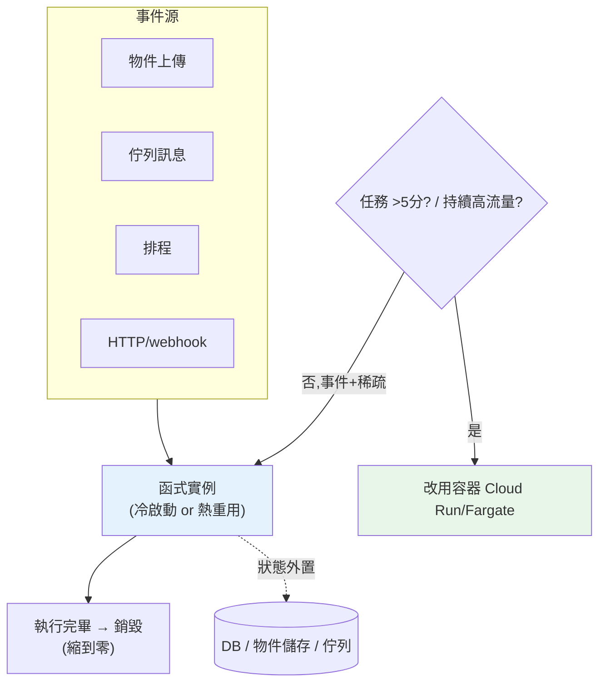

# Serverless:Lambda vs Cloud Functions

> [ch01](01-cloud-overview.md) 光譜的最右端是 **FaaS(Function as a Service,函式即服務)**——AWS **Lambda** 與 GCP **Cloud Functions**。你**只上傳一個函式**,雲負責在**事件觸發**時執行它、自動擴縮、閒置不收錢。這是**事件驅動、短任務、不定流量**的最佳解:上傳圖片觸發縮圖、排程對帳、webhook 處理、佇列消費。這章講清楚 FaaS 的執行模型(事件、冷啟動、無狀態、執行上限)、與 Cloud Run 容器的界線、Lambda vs Cloud Functions 差異,並用 Python 實作成本模型與冷啟動估算。

## Why(為什麼)

有了容器(上一章的 Cloud Run/Fargate),為什麼還要 FaaS?因為有一類工作,**連容器都嫌重**:

- **事件驅動的零碎工作**:一張圖片上傳到 [S3/GCS](06-managed-db-storage.md) → 產生縮圖;一則訊息進佇列 → 處理它;一個排程到點 → 跑對帳。這些是**「有事才做、做完就停」**的短任務——養一個常駐容器/服務等它很浪費。
- **極度不定、稀疏的流量**:一天觸發幾十次、且不規律。FaaS **閒置完全不收錢(縮到零)**、來事件才啟動、瞬間可並行大量實例——按呼叫次數 + 執行時間計費,對稀疏工作最省。
- **不想管任何基礎設施**:FaaS 是**抽象最高**的一層——沒有容器、沒有埠、沒有健康檢查,只有「函式 + 觸發器」。心智負擔最小。
- **黏合雲服務的膠水**:FaaS 天生與雲的事件源整合(S3 事件、Pub/Sub、排程、DB 變更),是把各服務**串起來的膠水**。

**但 FaaS 有硬限制**(執行時間上限、冷啟動、無狀態、資源上限),不是什麼都能塞。這章幫你判斷「這個工作該用 FaaS、還是 Cloud Run 容器」——這是雲上最常見的選型題之一。

## Theory(理論:FaaS 執行模型)

FaaS 的核心是**事件觸發的無狀態函式**:

```text
事件源 ──觸發──> 函式實例(短生命)──> 執行你的程式碼 ──> 結束銷毀
  │                    ↑ 冷啟動(首次/擴容時)
  ├─ HTTP 請求         ↑ 或 熱重用(近期用過的實例)
  ├─ 物件上傳(S3/GCS)
  ├─ 訊息佇列(SQS/Pub/Sub)
  ├─ 排程(cron)
  └─ DB 變更 / 其他雲事件
```

**關鍵特性**:

- **事件驅動**:函式**被動**被觸發,不主動輪詢(輪詢是反模式)。
- **自動擴縮到並行**:同時來 1000 個事件,雲可能起 1000 個函式實例並行處理(有並發上限)。
- **縮到零**:沒事件 = 沒實例 = 不收錢。
- **無狀態、短命**:每次執行是**獨立**的,實例隨時被銷毀;狀態必須外置。
- **執行時間上限**:有**最長執行時間**(Lambda 最長 15 分鐘;Cloud Functions 依版本/類型不同)——**超時就被殺**。長任務不適合。
- **按用量計費**:大致 `呼叫次數 + (記憶體 × 執行時間)`;不執行不收錢。

## Specification(規範:Lambda vs Cloud Functions,以及 vs Cloud Run)

**Lambda vs Cloud Functions**:

| 面向 | AWS Lambda | GCP Cloud Functions |
|------|-----------|---------------------|
| **最長執行時間** | 15 分鐘 | 2nd gen 最長 60 分鐘(HTTP 觸發較短);1st gen 9 分鐘 |
| **觸發器** | API Gateway、S3、SQS、EventBridge(排程)、DynamoDB Streams… | HTTP、Pub/Sub、Cloud Storage、Cloud Scheduler、Firestore… |
| **部署單位** | 函式(zip / 容器映像) | 函式(原始碼 / 容器,2nd gen 基於 Cloud Run) |
| **並發控制** | reserved / provisioned concurrency | 最大實例數、min instances |
| **冷啟動緩解** | Provisioned Concurrency | min instances |
| **底層** | Firecracker microVM | 2nd gen 建於 Cloud Run/Knative |

**FaaS vs 容器(Cloud Run/Fargate)——選型的關鍵界線**:

| 判準 | 選 FaaS(Lambda/Functions) | 選容器(Cloud Run/Fargate) |
|------|---------------------------|----------------------------|
| 工作型態 | 事件驅動、短任務(秒~分鐘) | 常駐 HTTP 服務、較長處理 |
| 執行時間 | 短(受上限約束) | 長(無 FaaS 的硬上限) |
| 流量 | 稀疏、突發、不定 | 持續、可預測 |
| 複雜度 | 單一函式、簡單 | 完整應用(多路由、框架) |
| 依賴/映像 | 輕量(大依賴使冷啟動更痛) | 任意(完整容器) |

> **界線正在模糊**:Cloud Functions 2nd gen 建於 Cloud Run、Lambda 支援容器映像——兩者趨同。實務判準回到:**「事件驅動的短任務」偏 FaaS、「常駐服務」偏容器**。

## Implementation(底層:冷啟動、無狀態、成本)

**冷啟動(cold start)——FaaS 最重要的效能議題**:當沒有可重用的熱實例(首次呼叫、或擴容加實例),雲要**現起一個執行環境**:配置 microVM/容器 → 載入 runtime → 載入你的程式與依賴 → 執行 init 程式碼。這段延遲就是冷啟動,**依 runtime 與依賴大小從數十毫秒到數秒**。之後該實例會被**保溫重用(warm)** 一陣子,後續呼叫沒有冷啟動。

**影響冷啟動的因素與緩解**:

- **依賴/套件大小**:Python 帶一堆重套件(pandas、numpy)會拉長冷啟動 → **精簡依賴、只裝必要**。
- **init 程式碼**:把重初始化(建連線、載模型)放在 **handler 外**(模組層級)→ 熱實例重用時只跑一次。
- **保溫**:設 **provisioned concurrency / min instances** 消除冷啟動(犧牲一點省錢)。
- **runtime**:輕量 runtime 冷啟動較快。

**無狀態 + handler 外初始化的慣例**(重要模式):

```python
# 模組層級:冷啟動時執行一次;熱實例重用時「不再執行」
import boto3
_client = boto3.client("s3")  # 連線在 handler 外建立 → 熱重用

def handler(event, context):   # 每個事件執行 handler 本體
    # 用 _client 處理 event...
    return {"statusCode": 200}
```

**為何這樣寫**:handler 外的東西在實例**存活期間只初始化一次**,被後續事件重用;放 handler 裡則**每次事件都重建**(慢又浪費)。但**別在實例間共享可變狀態**——實例會被銷毀、且多實例不共享記憶體,狀態仍要外置。

**成本模型**:`成本 ≈ 呼叫次數 × 單價 + Σ(記憶體GB × 執行秒數) × 單價`。下面用 Python 實作,並比較「FaaS vs 常駐容器」的成本交叉點。

## Code Example(可執行的 Python 範例)

```python
# serverless.py — FaaS 成本模型 + 冷啟動估算 + FaaS/容器選型(純標準庫)
from __future__ import annotations

from dataclasses import dataclass


@dataclass
class FaaSPricing:
    per_million_requests: float  # 每百萬次呼叫美元
    per_gb_second: float         # 每 GB-秒 美元


def faas_monthly_cost(invocations: int, avg_duration_s: float,
                      memory_gb: float, pricing: FaaSPricing) -> float:
    """估 FaaS 月成本 = 呼叫費 + 運算費(GB-秒)。"""
    request_cost = (invocations / 1_000_000) * pricing.per_million_requests
    gb_seconds = invocations * avg_duration_s * memory_gb
    compute_cost = gb_seconds * pricing.per_gb_second
    return round(request_cost + compute_cost, 4)


def choose_compute(event_driven: bool, avg_duration_s: float,
                   sparse_traffic: bool) -> str:
    """FaaS vs 容器 的選型建議。"""
    if avg_duration_s > 300:  # 超過 5 分鐘,逼近/超過 FaaS 上限
        return "容器(Cloud Run/Fargate)- 任務過長,FaaS 有執行上限"
    if event_driven and sparse_traffic:
        return "FaaS(Lambda/Cloud Functions)- 事件驅動 + 稀疏流量最省"
    if not sparse_traffic:
        return "容器(Cloud Run)- 持續流量下常駐更划算且無冷啟動"
    return "FaaS 或容器皆可,依團隊熟悉度"


def main() -> None:
    # 近似 Lambda 定價(示意值,實際以官方為準)
    pricing = FaaSPricing(per_million_requests=0.20, per_gb_second=0.0000166667)

    print("FaaS 月成本估算(記憶體 0.5GB, 每次 0.2s):")
    for inv in (10_000, 1_000_000, 50_000_000):
        cost = faas_monthly_cost(inv, avg_duration_s=0.2, memory_gb=0.5,
                                 pricing=pricing)
        print(f"  {inv:>11,} 次/月 -> ${cost}")

    print("\n選型建議:")
    cases = [
        ("圖片上傳觸發縮圖", True, 2.0, True),
        ("每日對帳排程", True, 30.0, True),
        ("高流量常駐 API", False, 0.1, False),
        ("每筆需 10 分鐘的批次轉檔", True, 600.0, True),
    ]
    for name, ev, dur, sparse in cases:
        print(f"  {name}: {choose_compute(ev, dur, sparse)}")


if __name__ == "__main__":
    main()
```

**預期輸出**:

```pycon
$ python serverless.py
FaaS 月成本估算(記憶體 0.5GB, 每次 0.2s):
       10,000 次/月 -> $0.0187
    1,000,000 次/月 -> $1.8667
   50,000,000 次/月 -> $93.3335

選型建議:
  圖片上傳觸發縮圖: FaaS(Lambda/Cloud Functions)- 事件驅動 + 稀疏流量最省
  每日對帳排程: FaaS(Lambda/Cloud Functions)- 事件驅動 + 稀疏流量最省
  高流量常駐 API: 容器(Cloud Run)- 持續流量下常駐更划算且無冷啟動
  每筆需 10 分鐘的批次轉檔: 容器(Cloud Run/Fargate)- 任務過長,FaaS 有執行上限
```

逐段解說:

- **`faas_monthly_cost`**:成本兩部分——**呼叫次數費** + **運算費(GB-秒)**。GB-秒 = 呼叫數 × 每次秒數 × 記憶體 GB,這是 FaaS 計費核心(且運算費常是大宗)。1 萬次不到 2 美分、幾近免費——**FaaS 對稀疏流量極便宜**;但注意呼叫數放大時**運算費(GB-秒)會主導**成本(5000 萬次來到約 $93)。
- **成本交叉點的直覺**:FaaS 便宜是因為**離峰不收錢**;但當流量**持續且高**,你其實一直在付運算費,此時**常駐容器(固定規格)反而可能更便宜**、又沒有冷啟動——這就是 `choose_compute` 對「高流量常駐 API」建議容器的原因。
- **`choose_compute` 的判準優先序**:先看**執行時間**(>5 分鐘直接排除 FaaS,因為有上限)→ 再看**事件驅動 + 稀疏**(FaaS 甜蜜點)→ 再看**持續流量**(偏容器)。10 分鐘的批次轉檔即使事件驅動,也因**超過 FaaS 執行上限**而選容器。
- **要點**:FaaS = 事件驅動、短任務、稀疏流量、縮到零最省;有**執行時間上限與冷啟動**;成本按呼叫 + GB-秒;高持續流量或長任務改用容器。

## Diagram(圖解:FaaS 事件模型與選型)



## Best Practice(最佳實踐)

- **FaaS 用於事件驅動短任務**:上傳觸發、佇列消費、排程、webhook;稀疏流量最省。
- **重初始化放 handler 外**:連線/客戶端在模組層級建立,熱實例重用只跑一次。
- **精簡依賴**:少裝重套件,縮短冷啟動;必要時用 layer/容器映像管理。
- **延遲敏感設 provisioned concurrency / min instances**:消除冷啟動。
- **無狀態、狀態外置**:實例短命、多份、不共享記憶體;狀態進 DB/物件儲存/佇列。
- **冪等處理**:事件可能重送(at-least-once),處理要可重複執行不出錯。
- **長任務/持續高流量改用容器**:避開執行上限與冷啟動,常駐更划算。
- **函式要小而專一**:一個函式做一件事,好測、好維護、冷啟動快。
- **最小權限 IAM**:函式掛專屬 role/SA,只給它需要的權限([ch02](02-iam.md))。

## Common Mistakes(常見誤解)

- **拿 FaaS 跑長任務**:撞執行時間上限被殺;長任務用容器或拆分 + 佇列。
- **重初始化寫在 handler 裡**:每次事件都重建連線/載模型,又慢又貴;放 handler 外。
- **假設實例會保留狀態**:實例會被銷毀、多實例不共享;狀態必外置。
- **忽略冷啟動**:延遲敏感卻不保溫,首請求爆慢;設 provisioned/min instances。
- **塞一堆重依賴**:冷啟動被拖垮;精簡套件。
- **未處理重複事件**:at-least-once 下事件會重送,非冪等處理造成重複扣款/重複寫入。
- **在高持續流量硬用 FaaS**:可能比常駐容器更貴且有冷啟動;算成本交叉點。
- **用函式輪詢外部**:輪詢與 FaaS 模型相悖;改用事件觸發。

## Interview Notes(面試重點)

- **能講 FaaS 執行模型**:事件驅動、無狀態短命、自動擴縮並行、縮到零、執行時間上限。
- **能講冷啟動與緩解**:無熱實例時現起環境的延遲;精簡依賴、handler 外初始化、provisioned/min instances。
- **能講 FaaS vs 容器的界線**:事件驅動短任務/稀疏流量選 FaaS;常駐服務/長任務/持續高流量選容器。
- **能講成本模型**:呼叫次數 + GB-秒;稀疏極省、持續高流量可能反而貴(成本交叉點)。
- **能講 at-least-once 與冪等**:事件可能重送,處理要冪等。
- **能對照 Lambda vs Cloud Functions**:執行上限、觸發器、冷啟動緩解手段;2nd gen 建於 Cloud Run 使兩者趨同。

---

➡️ 下一章:[託管資料庫與物件儲存](06-managed-db-storage.md)

[⬆️ 回 Part 31 索引](README.md)
