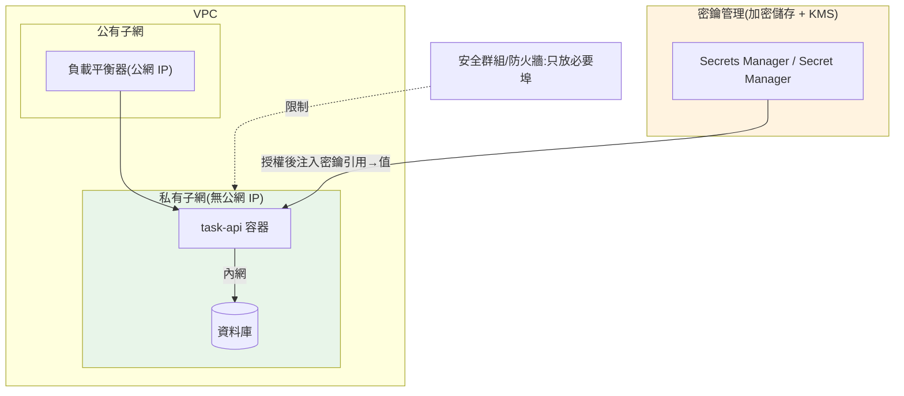

# 密鑰、設定與網路

> 應用要跑起來,需要**設定(configuration)** 與**密鑰(secrets)**:DB 連線字串、API 金鑰、第三方憑證。[12-factor](../19-cloud-native/README.md) 說「設定放環境、與程式碼分離」——但**密鑰不能像一般設定那樣隨便放**(不能進版控、不能寫死、要能輪替與稽核)。這章講清楚**設定 vs 密鑰的分野**、雲的**密鑰管理服務**(AWS Secrets Manager / GCP Secret Manager)、以及讓資料庫/服務不暴露公網的**網路基礎**(VPC、子網、安全群組)。並用 Python 實作設定載入優先序與密鑰引用解析。

## 💡 白話導讀(建議先讀)

應用要跑起來,得餵它兩種東西:**設定**(log 等級、region、feature flag)
和**密鑰**(DB 密碼、API 金鑰)。這兩者長得像,但**安全等級天差地遠**,
混為一談是雲上事故的常見源頭。這章講怎麼在雲上正確地餵設定、藏密鑰、隔網路。

**設定 vs 密鑰——分野是「洩漏了會不會出事」:**

- **設定**:非敏感,洩漏無所謂——可以放環境變數、明碼設定檔。
- **密鑰**:敏感,**洩漏即損害**——**絕不能**進程式碼、進 git、進明碼環境變數。
  要放進雲的**密鑰管理服務**(AWS Secrets Manager / GCP Secret Manager),
  由服務靠 [IAM 角色](02-iam.md)按需領取——這是 [Part 20 secrets 章](../20-security-system-design/05-secrets-management.md)
  在雲上的正規解法。

**網路分層——別讓資料庫裸奔在公網上:**

雲的網路(VPC)讓你劃分**公開**與**私有**區域:

```text
網際網路 → [公開子網:負載平衡器/API] → [私有子網:資料庫、內部服務]
                                          ↑ 沒有公網 IP,外面連不到
```

你的 task-api 容器可以對外(收請求),但**資料庫只該待在私有子網**——
只有你的應用連得到,公網完全碰不到它。這樣就算應用層被攻破,
資料庫也多一層保護(呼應[縱深防禦]的資安思維)。

這章帶你把 task-api 的密鑰接上 Secret Manager、
用 IAM 角色領取(不落地任何金鑰)、並把 DB 關進私有子網——
把「能動」的部署,升級成「安全」的部署。

## Why(為什麼)

「把 DB 密碼寫在 `config.py` 裡」為什麼是災難?因為密鑰有**一般設定沒有的要求**:

- **密鑰外洩是頭號資安事故**:GitHub 上被掃到的 AWS key、寫死在程式裡的 DB 密碼、打進 Docker 映像的憑證——這些是**資料外洩的最大宗來源**。密鑰一旦進版控/映像,就**永久存在歷史裡**,改了也難清乾淨。
- **設定與密鑰要用不同機制**:一般設定(log level、feature flag、region)可以放環境變數、明碼設定檔;但**密鑰要加密儲存、存取要授權與稽核、要能輪替**——這是密鑰管理服務的職責,不是 `.env` 檔能滿足的。
- **輪替(rotation)是常態需求**:憑證定期輪替、或外洩後緊急輪替——如果密鑰散落在各處(程式、環境變數、多台機器),輪替是惡夢。集中管理才能一鍵輪替。
- **網路是縱深防禦的一層**:就算 IAM 配對了,**把資料庫直接開在公網**仍是巨大風險。DB 應該**只在私有網路內**、只讓應用連得到。理解 VPC/子網/安全群組,才能把攻擊面收到最小。

**核心心法**:**設定與密鑰分離、密鑰集中加密管理、資料層私有化**。這章讓你的服務「設定乾淨、密鑰安全、網路收斂」。

## Theory(理論:設定 vs 密鑰,以及網路分層)

**設定 vs 密鑰的分野**:

```text
設定(config)                      密鑰(secret)
├─ log level, region, feature flag  ├─ DB 密碼, API key, 私鑰, token
├─ 非敏感                           ├─ 敏感:洩漏即損害
├─ 可進環境變數/明碼設定檔          ├─ 不可進版控/映像/明碼
├─ 12-factor:放環境                ├─ 存密鑰管理服務,執行期注入
└─ 變更頻率低                       └─ 需輪替、稽核、授權存取
```

兩者都遵循 **「與程式碼分離、執行期注入」**,但密鑰**多一層加密儲存與存取控制**。

**設定載入的優先序(常見慣例)**——後者覆蓋前者:

```text
預設值(程式內建) < 設定檔 < 環境變數 < 密鑰管理注入 < 明確覆寫
低優先 ─────────────────────────────────────────> 高優先
```

**網路分層(以雲的 VPC 為例)**:

```text
┌── VPC(虛擬私有網路)──────────────────────────────┐
│  ┌─ 公有子網(public subnet)──────────────────┐   │
│  │  對外服務 / 負載平衡器(有公網 IP)         │   │
│  └───────────────────────────────────────────┘   │
│  ┌─ 私有子網(private subnet,無公網 IP)──────┐   │
│  │  應用容器 · 資料庫 · 快取(只在內網互通)   │   │
│  └───────────────────────────────────────────┘   │
│  安全群組 / 防火牆規則:誰能連誰的哪個埠          │
└────────────────────────────────────────────────────┘
```

**原則**:**對外的放公有子網、資料層放私有子網、用安全群組限制流向**——資料庫不該有公網 IP。

## Specification(規範:AWS ↔ GCP 密鑰與網路對照)

| 類別 | AWS | GCP |
|------|-----|-----|
| **密鑰管理** | Secrets Manager / SSM Parameter Store | Secret Manager |
| **虛擬網路** | VPC | VPC |
| **子網** | Subnet(public/private) | Subnet |
| **防火牆** | Security Group + NACL | Firewall Rules |
| **私有服務連線** | VPC Endpoint / PrivateLink | Private Service Connect / VPC peering |
| **對外閘道** | Internet Gateway / NAT Gateway | Cloud NAT |
| **金鑰加密** | KMS | Cloud KMS |

**密鑰引用示意**(部署時把密鑰**引用**注入,而非把值寫進設定):

```yaml
# Cloud Run:把 Secret Manager 的密鑰掛成環境變數
gcloud run deploy task-api \
  --set-secrets=DB_PASSWORD=projects/p/secrets/db-password:latest

# ECS Task Definition:從 Secrets Manager 注入
"secrets": [{"name": "DB_PASSWORD",
             "valueFrom": "arn:aws:secretsmanager:...:secret:db-password"}]
```

**重點**:部署設定裡放的是**密鑰的「引用位址」**(ARN / resource name),**不是密鑰的值**——執行期由平台解析、注入成環境變數。這樣設定檔可進版控(裡面沒有明文密鑰)。

## Implementation(底層:密鑰注入、輪替、私有連線)

**密鑰怎麼安全地到達應用**(避免明文落地):

1. **儲存**:密鑰以加密形式存在 Secrets Manager / Secret Manager(背後用 KMS 加密)。
2. **授權**:應用的 role/service account 被授予「讀取特定密鑰」的權限([ch02 最小權限](02-iam.md))——只能讀它需要的那把。
3. **注入**:部署時平台把密鑰**解密後注入成環境變數**,或應用啟動時**用 SDK 拉取**。
4. **稽核**:每次存取被記錄(誰、何時、讀哪把)——外洩調查與合規需要。

**兩種注入方式的取捨**:

- **環境變數注入**(平台幫你注入):簡單,但密鑰**存在於程序環境中**(某些情境可被 dump)。
- **執行期用 SDK 拉取**:應用啟動時呼叫密鑰服務取得,可**快取 + 支援輪替**(定期重拉),但要寫程式碼。

**輪替(rotation)為何靠集中管理才可行**:密鑰集中在一處,輪替時**更新一個地方**,應用下次拉取/重啟就拿到新值(配合 rotation lambda 可自動換 DB 密碼)。若密鑰散落各處,輪替要改 N 個地方、極易遺漏。

**私有連線——讓 DB 不出公網**:應用在私有子網、DB 也在私有子網,兩者經**內網**互通;DB **沒有公網 IP**。若應用要連雲的其他服務(如 Secrets Manager、S3)又不想走公網,用 **VPC Endpoint / Private Service Connect** 讓流量**留在雲內網**。這把資料層的攻擊面**收到幾乎為零**——外部根本連不到 DB。下面用 Python 實作設定優先序與密鑰引用解析。

## Code Example(可執行的 Python 範例)

```python
# config_secrets.py — 設定優先序載入 + 密鑰引用解析(純標準庫)
from __future__ import annotations

import os
from dataclasses import dataclass


def load_config(defaults: dict[str, str], file_cfg: dict[str, str],
                env: dict[str, str]) -> dict[str, str]:
    """設定優先序:defaults < 設定檔 < 環境變數(後者覆蓋前者)。"""
    merged = dict(defaults)
    merged.update(file_cfg)
    merged.update({k: v for k, v in env.items() if k in defaults or k in file_cfg
                   or True})  # 環境變數可新增或覆蓋
    return merged


def is_secret_ref(value: str) -> bool:
    """判斷設定值是否為密鑰引用(而非明文密鑰)。"""
    return value.startswith(("secret://", "arn:aws:secretsmanager:",
                             "projects/"))


def resolve_secret(ref: str, vault: dict[str, str]) -> str:
    """模擬:把密鑰引用解析成實際值(真實情境走 Secrets Manager SDK)。"""
    if not is_secret_ref(ref):
        raise ValueError(f"不是合法的密鑰引用: {ref!r}")
    key = ref.split("/")[-1].split(":")[0]  # 取末段路徑、去掉版本後綴當 key
    if key not in vault:
        raise KeyError(f"密鑰不存在: {key}")
    return vault[key]


def audit_config(cfg: dict[str, str]) -> list[str]:
    """檢查設定裡是否有『疑似明文密鑰』(反模式)。"""
    warnings: list[str] = []
    suspicious = ("password", "secret", "token", "api_key", "private_key")
    for k, v in cfg.items():
        if any(s in k.lower() for s in suspicious) and not is_secret_ref(v):
            warnings.append(f"{k} 疑似明文密鑰,應改用密鑰引用")
    return warnings


def main() -> None:
    defaults = {"LOG_LEVEL": "INFO", "REGION": "ap-northeast-1"}
    file_cfg = {"LOG_LEVEL": "WARNING", "DB_HOST": "task-db.internal"}
    env = {"REGION": "asia-east1",  # 環境變數覆蓋
           "DB_PASSWORD": "projects/p/secrets/db-password:latest"}  # 密鑰引用

    cfg = load_config(defaults, file_cfg, env)
    print("最終設定(注意優先序覆蓋):")
    for k, v in sorted(cfg.items()):
        print(f"  {k} = {v}")

    print("\n密鑰解析:")
    vault = {"db-password": "s3cr3t-Pa55"}
    resolved = resolve_secret(cfg["DB_PASSWORD"], vault)
    print(f"  DB_PASSWORD 引用 -> 解析得到 (長度 {len(resolved)} 的密碼,不印明文)")

    print("\n設定稽核:")
    bad_cfg = {"DB_PASSWORD": "hardcoded123", "LOG_LEVEL": "INFO"}
    for w in audit_config(bad_cfg) or ["OK,無明文密鑰"]:
        print(f"  {w}")


if __name__ == "__main__":
    main()
```

**預期輸出**:

```pycon
$ python config_secrets.py
最終設定(注意優先序覆蓋):
  DB_HOST = task-db.internal
  DB_PASSWORD = projects/p/secrets/db-password:latest
  LOG_LEVEL = WARNING
  REGION = asia-east1

密鑰解析:
  DB_PASSWORD 引用 -> 解析得到 (長度 11 的密碼,不印明文)

設定稽核:
  DB_PASSWORD 疑似明文密鑰,應改用密鑰引用
```

逐段解說:

- **`load_config` 優先序**:`REGION` 預設 `ap-northeast-1`,被環境變數覆蓋成 `asia-east1`;`LOG_LEVEL` 被設定檔覆蓋成 `WARNING`。**後者覆蓋前者**是設定系統的通則——讓部署環境能覆寫預設,而不改程式碼。
- **`is_secret_ref` / `resolve_secret`**:`DB_PASSWORD` 的值不是明文,而是**引用位址**(`projects/p/secrets/...`)。執行期才解析成真值——**設定檔裡沒有明文密碼,可安全進版控**。解析後**不印明文**(示範連日誌都不該印密鑰)。
- **`audit_config` 抓反模式**:掃描設定裡「名字像密鑰、值卻是明文」的項目——`DB_PASSWORD = hardcoded123` 被抓出來警告。**這種檢查可放進 CI**,擋下寫死密鑰的提交。
- **要點**:設定與密鑰分離;設定有優先序(環境覆寫預設);密鑰在設定裡只放**引用**、執行期注入、不落明文;可用稽核擋寫死密鑰。

## Diagram(圖解:密鑰注入與網路分層)



## Best Practice(最佳實踐)

- **設定與密鑰分離**:設定走環境變數/設定檔;密鑰走密鑰管理服務。
- **絕不把密鑰進版控/映像/明文**:設定裡只放**引用**,執行期注入;`.gitignore` 憑證。
- **最小權限讀密鑰**:每個服務只能讀它需要的那幾把([ch02](02-iam.md))。
- **啟用輪替與稽核**:定期輪替、記錄每次存取;外洩能快速換掉。
- **資料層私有化**:DB/快取放私有子網、無公網 IP,只讓應用連。
- **安全群組最小開放**:只開必要的埠與來源,預設拒絕。
- **雲內流量走私有連線**:VPC Endpoint / Private Service Connect,不繞公網。
- **CI 掃描寫死密鑰**:用 secret scanner(如 gitleaks)擋提交。
- **設定優先序清楚**:預設 < 設定檔 < 環境 < 密鑰注入,讓部署可覆寫不改碼。

## Common Mistakes(常見誤解)

- **DB 密碼寫死在程式/設定檔/映像**:頭號外洩源,且進了 git 歷史難清除。
- **把密鑰當一般環境變數明文放**:密鑰要加密儲存 + 授權 + 稽核,不是 `.env` 明文能滿足。
- **DB 開公網 + 弱密碼**:被掃描爆破;放私有子網。
- **安全群組開 `0.0.0.0/0` 到所有埠**:等於不設防;只開必要來源與埠。
- **所有服務共用一把密鑰讀取權限**:違反最小權限,一處失守全洩。
- **從不輪替**:憑證長期有效,外洩損害無限延長。
- **把密鑰印進日誌**:日誌會被彙整/外流;遮蔽或根本別印。
- **以為 IAM 對了就不用管網路**:縱深防禦——網路是獨立一層,DB 仍要私有化。
- **設定沒有優先序**:寫死值、換環境要改碼;用「環境覆寫預設」的層級。

## Interview Notes(面試重點)

- **能講設定 vs 密鑰的分野**:設定放環境;密鑰要加密儲存 + 授權 + 稽核 + 輪替,走密鑰管理服務。
- **能講密鑰安全注入流程**:加密儲存(KMS)→ 最小權限授權 → 執行期注入/SDK 拉取 → 稽核;設定裡只放引用。
- **能講輪替為何靠集中管理**:散落各處無法一致輪替;集中才能一鍵換。
- **能講網路分層**:VPC + 公/私有子網 + 安全群組;DB 放私有、無公網 IP。
- **能講私有連線**:VPC Endpoint / Private Service Connect 讓雲內流量不繞公網。
- **能對照 AWS/GCP**:Secrets Manager/Secret Manager、Security Group/Firewall Rules、KMS/Cloud KMS。
- **能講縱深防禦**:IAM + 網路 + 密鑰管理多層,不靠單一防線。

---

➡️ 下一章:[IaC:Terraform 多雲](08-iac-terraform.md)

[⬆️ 回 Part 31 索引](README.md)
