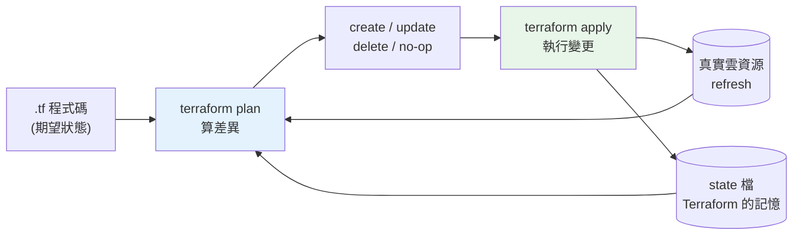

# IaC:Terraform 多雲

> 前面幾章都在「用 console 或 CLI 手動建資源」。但手動點按**無法重現、無法審查、無法版控、容易漂移**。**IaC(Infrastructure as Code,基礎設施即程式碼)** 把「要哪些雲資源」寫成**宣告式程式碼**,像管程式一樣管基礎設施。**Terraform** 是最主流的 IaC 工具,且**跨雲**——同一套工作流管 AWS 與 GCP。這章講清楚 IaC 的核心觀念(宣告式、state、plan/apply、冪等)、為何它是雲上工程化的基石,並用 Python 實作一個迷你「宣告式 reconcile(調和)」引擎來說明 Terraform 的運作原理。

## 💡 白話導讀(建議先讀)

前面幾章你都在「**用 console 點按、或用 CLI 手動建資源**」。
這對學習很好,但對真實專案是**災難的配方**:
手動點出來的環境**無法重現**(換個人、換個 region 就得重點一遍、還可能點錯)、
**無法審查**(誰改了什麼?不知道)、**無法版控**、**容易漂移**
(有人偷偷手改了設定,和文件對不上)。**IaC(基礎設施即程式碼)** 就是解方。

核心思想:**把「要哪些雲資源」寫成程式碼**,像管理應用程式碼一樣管理你的基礎設施——
進 git、走 code review、可重現、可回滾。主角是 **Terraform**。

Terraform 的精髓是**宣告式**(和你熟悉的 [K8s](../19-cloud-native/06-kubernetes.md)、
[SQL](../15-database/README.md) 同一個哲學):

```text
命令式(你下指令):  "建一台 VM,然後開 443 埠,然後建 DB..."(自己顧順序與狀態)
宣告式(你描述目標): "我要:1 台 VM + 443 開放 + 1 個 DB"
                     Terraform 比對「現狀 vs 目標」,自動算出差異、只補該補的
```

你只**描述最終想要的樣子**,Terraform 自己看「現在有什麼、缺什麼」,
產生一份**執行計畫(plan)** 給你確認,再實際套用(apply)——
和 K8s 的「宣告期望狀態、controller 自動收斂」是同一個腦袋。

這章帶你用 Terraform 把前面手動建的東西(Cloud Run 服務、資料庫、IAM、密鑰)
**全部寫成程式碼**,一鍵 `terraform apply` 重建整套環境。
還會講幾個關鍵概念:**state 檔**(Terraform 記住「它管了哪些資源」的帳本,要妥善保存)、
**plan 先看再 apply** 的安全習慣、以及模組化。這是現代雲端工程的**核心技能**。

## Why(為什麼)

「我用 console 點一點就把服務開起來了」——為什麼還要學 IaC?因為手動管理在真實團隊會崩潰:

- **無法重現**:手動建的環境,換個人、換個 region、要建 staging/prod 兩套——**沒人記得完整點了哪些**。IaC 讓環境**一鍵重建、完全一致**。
- **無法審查與追溯**:誰改了安全群組?什麼時候?為什麼?手動改**沒有記錄**。IaC 是程式碼,走 **PR review + git 歷史**——每次基礎設施變更都可審查、可追溯、可回滾。
- **組態漂移(configuration drift)**:手動改了 console,程式碼/文件沒跟上,環境逐漸與預期不符——**漂移是事故的溫床**。IaC 以**程式碼為單一事實來源(source of truth)**,能偵測並校正漂移。
- **跨雲/多環境的一致性**:用 Terraform,AWS 與 GCP、dev/staging/prod 用**同一套語言與工作流**——不必為每個雲學一套 CLI 手法。
- **與 CI/CD 結合**:IaC 能進 [CI/CD 管線](09-cicd-to-cloud.md),讓「改基礎設施」跟「改程式碼」一樣自動化、有測試、有審批。

**核心心法**:**基礎設施是程式碼,不是手工藝**。宣告「我要什麼」,讓工具算出「怎麼達成」並維持它。這章讓你理解 Terraform 為何這樣設計。

## Theory(理論:宣告式 IaC 與 reconcile)

IaC 有兩種風格,Terraform 屬**宣告式**:

```text
命令式(imperative)          宣告式(declarative,Terraform)
"建一台 VM,然後開埠 443,      "我要:1 台 VM + 443 開放 + 1 個 DB"
 然後建 DB..."                工具比對現狀與目標,算出差異並執行
你寫「步驟」                   你寫「期望狀態」,工具算「怎麼到達」
```

**宣告式的核心循環——reconcile(調和)**:

```text
期望狀態(你的 .tf 程式碼)
        vs
目前狀態(state 檔記錄的 + 雲上實際)
        ↓
   計算差異(diff / plan)
        ↓
   執行變更讓「實際」趨近「期望」(apply)
        ↓
   更新 state 記錄
```

**Terraform 三個關鍵概念**:

- **State(狀態檔)**:Terraform 記錄「它管的資源目前長怎樣」的檔案。**plan 靠它比對**——沒有 state 就不知道該建、該改、還是該刪。生產環境 state 要放**遠端後端**(S3 + DynamoDB 鎖 / GCS),供團隊共用並防併發衝突。
- **Plan**:**預演**——顯示「將建立/修改/刪除什麼」,**不實際執行**。這是 IaC 的安全網:先看清楚才 apply。
- **Apply**:實際執行 plan 的變更,並更新 state。

**冪等(idempotent)**:同一份程式碼 apply 多次,結果一致——已存在且符合期望的資源**不會被重複建立**。這是宣告式的關鍵性質:**描述終態,重跑安全**。

## Specification(規範:Terraform 結構與多雲)

**Terraform 用 HCL(HashiCorp Configuration Language)**,核心是 **provider + resource**:

```hcl
# AWS provider:建一個 S3 bucket
provider "aws" {
  region = "ap-northeast-1"
}
resource "aws_s3_bucket" "uploads" {
  bucket = "task-api-uploads"
}

# GCP provider:建一個 GCS bucket(同一份 Terraform 專案可同時管兩雲)
provider "google" {
  project = "my-project"
  region  = "asia-east1"
}
resource "google_storage_bucket" "uploads" {
  name     = "task-api-uploads"
  location = "ASIA-EAST1"
}
```

**核心指令流**:

| 指令 | 作用 |
|------|------|
| `terraform init` | 下載 provider、初始化後端(state 位置) |
| `terraform plan` | 預演:顯示將建/改/刪什麼(不執行) |
| `terraform apply` | 執行變更、更新 state |
| `terraform destroy` | 刪除所管資源 |
| `terraform fmt` / `validate` | 格式化 / 語法驗證(可進 CI) |

**多雲/多環境的組織**:用 **module**(可重用的資源組)封裝、用 **variables + workspace / 目錄分層** 管 dev/staging/prod 差異——同一套模組、不同參數。**AWS 與 GCP 各有 provider,但工作流(init/plan/apply)完全相同**——這是 Terraform「多雲一致」的價值。

## Implementation(底層:state、plan diff、鎖)

**plan 如何算出差異(reconcile 的心臟)**:Terraform 把三者比對——

1. **期望狀態**:你的 `.tf` 程式碼描述的資源。
2. **上次 state**:state 檔記錄的「Terraform 認為的現狀」。
3. **真實狀態**:呼叫雲 API 讀到的實際資源(refresh)。

比對後產生**動作分類**:

- **create**:程式碼有、state/實際沒有 → 建立。
- **update**:都有但屬性不同 → 修改(有些屬性須 replace = 刪了重建)。
- **delete**:state/實際有、程式碼移除了 → 刪除。
- **no-op**:一致 → 不動(**冪等的體現**)。

**為何一定要有 state**:雲 API 通常只能問「這個資源現在長怎樣」,無法問「哪些資源是 Terraform 建的」。**state 是 Terraform 的記憶**——記錄它管了哪些資源、對映到程式碼哪個宣告。沒有 state,它無法區分「該刪的舊資源」與「別人建的、不該碰的資源」。

**state 鎖(locking)防併發災難**:兩個人同時 apply 會**互相踩踏 state**、造成損毀或重複建立。遠端後端提供**鎖**(S3+DynamoDB、GCS 原生鎖)——apply 時鎖住 state,別人要等。**團隊用 Terraform 必須用遠端 + 鎖的後端**,絕不把 state 放本機或進版控(state 含敏感值且會衝突)。下面用 Python 實作一個迷你 reconcile,呈現 create/update/delete/no-op 的計算。

## Code Example(可執行的 Python 範例)

```python
# iac.py — 迷你宣告式 reconcile 引擎(模擬 Terraform plan)(純標準庫)
from __future__ import annotations

from dataclasses import dataclass


@dataclass(frozen=True)
class Resource:
    name: str
    attrs: tuple[tuple[str, str], ...]  # 可雜湊的屬性集合


def plan(desired: dict[str, Resource],
         current: dict[str, Resource]) -> list[str]:
    """比對期望與現狀,產生變更計畫(模擬 terraform plan)。"""
    actions: list[str] = []
    # create / update:遍歷期望
    for name, want in desired.items():
        if name not in current:
            actions.append(f"+ create  {name}")
        elif current[name].attrs != want.attrs:
            actions.append(f"~ update  {name}")
        else:
            actions.append(f"  no-op   {name}")
    # delete:現狀有、期望沒有
    for name in current:
        if name not in desired:
            actions.append(f"- delete  {name}")
    return actions


def apply(desired: dict[str, Resource],
          current: dict[str, Resource]) -> dict[str, Resource]:
    """執行變更:讓 current 趨近 desired,回傳新的 state(冪等)。"""
    return dict(desired)  # 宣告式:終態就是 desired


def main() -> None:
    # 目前 state:一個 bucket + 一個 db(舊規格)
    current = {
        "s3_uploads": Resource("s3_uploads", (("versioning", "off"),)),
        "db_main": Resource("db_main", (("size", "small"),)),
    }
    # 期望:bucket 改開版本控制、db 不變、新增一個 cache;移除?無
    desired = {
        "s3_uploads": Resource("s3_uploads", (("versioning", "on"),)),  # 改
        "db_main": Resource("db_main", (("size", "small"),)),           # 不變
        "redis_cache": Resource("redis_cache", (("tier", "basic"),)),   # 新增
    }

    print("terraform plan(預演):")
    for line in plan(desired, current):
        print(f"  {line}")

    print("\napply 後再次 plan(應全為 no-op,證明冪等):")
    new_state = apply(desired, current)
    for line in plan(desired, new_state):
        print(f"  {line}")


if __name__ == "__main__":
    main()
```

**預期輸出**:

```pycon
$ python iac.py
terraform plan(預演):
    ~ update  s3_uploads
    no-op   db_main
  + create  redis_cache

apply 後再次 plan(應全為 no-op,證明冪等):
    no-op   s3_uploads
    no-op   db_main
    no-op   redis_cache
```

逐段解說:

- **`plan` 是 reconcile 的核心**:遍歷期望,分類成 **create**(期望有、現狀無)、**update**(都有但屬性不同)、**no-op**(一致);再檢查現狀有、期望無的 → **delete**。**這就是 `terraform plan` 幹的事**——把兩個狀態的差異算成一份動作清單給你審。
- **第一次 plan**:`s3_uploads` 因 versioning off→on 要 **update**、`db_main` 一致 **no-op**、`redis_cache` 是新的要 **create**。**你在 apply 前就清楚看到將發生什麼**——這是 IaC 的安全網。
- **冪等的證明**:apply 後 state = desired,**再 plan 全是 no-op**——重跑不會重複建立、不會亂改。這正是宣告式「描述終態、重跑安全」的性質。
- **對應真實 Terraform**:這裡的 `current` dict 就是 **state 檔**的抽象;真實 Terraform 還會 refresh 真實雲狀態、處理 replace、算依賴順序(DAG)——但**核心就是這個 diff→apply→更新 state 的循環**。
- **要點**:IaC 宣告期望狀態;plan 算差異(create/update/delete/no-op)、apply 執行並更新 state;state 是 Terraform 的記憶、要遠端 + 鎖;冪等讓重跑安全。

## Diagram(圖解:Terraform reconcile 循環)



## Best Practice(最佳實踐)

- **基礎設施全部 IaC 化**:別手動點 console;以程式碼為單一事實來源。
- **一律先 plan 再 apply**:apply 前看清楚將建/改/刪什麼,尤其注意 replace(刪重建)與 delete。
- **state 放遠端 + 鎖**:S3+DynamoDB / GCS,團隊共用、防併發;絕不進版控或放本機。
- **用 module 封裝、variables 管環境差異**:同套模組跑 dev/staging/prod。
- **IaC 進 CI/CD**:PR 跑 `fmt`/`validate`/`plan`,審查後才 apply([ch09](09-cicd-to-cloud.md))。
- **偵測並校正漂移**:定期 plan 找出手動改動,回歸程式碼為準。
- **最小權限的 IaC 執行身分**:CI 跑 Terraform 用專屬 role,別給無限權限。
- **敏感值不寫死在 .tf**:接密鑰管理([ch07](07-secrets-config-network.md)),state 也要視為含敏感值加密。
- **善用跨雲一致工作流**:AWS/GCP 同一套 init/plan/apply,降低多雲認知負擔。

## Common Mistakes(常見誤解)

- **手動改 console 造成漂移**:程式碼與實際不符,埋下事故;改動一律走 IaC。
- **state 放本機或進版控**:團隊會衝突、含敏感值外洩;用遠端 + 鎖後端。
- **不看 plan 直接 apply**:可能誤刪 DB/重建資源;先審 plan。
- **忽略 replace(force new)**:改某些屬性會**刪了重建**,對 DB = 資料遺失;看清楚再做。
- **多人同時 apply 無鎖**:state 損毀;用有鎖的遠端後端。
- **把密鑰寫死在 .tf**:進 git 就外洩;用變數 + 密鑰管理。
- **以為 Terraform 會自動修復漂移**:它只在你 plan/apply 時比對;要主動偵測。
- **一個巨大 state 管全部**:blast radius 大、apply 慢;按環境/領域拆分 state。

## Interview Notes(面試重點)

- **能講 IaC 的價值**:可重現、可審查、可版控、防漂移、單一事實來源;取代手動 console。
- **能講宣告式 vs 命令式**:宣告終態,工具算差異並維持;重跑冪等。
- **能講 Terraform 三概念**:state(記憶)、plan(預演差異)、apply(執行);reconcile 循環。
- **能講 state 為何必要 + 為何要遠端 + 鎖**:區分「它管的資源」、團隊共用、防併發損毀。
- **能講 plan 的動作分類**:create/update/delete/no-op,注意 replace 的破壞性。
- **能講多雲一致**:AWS/GCP 各有 provider,工作流相同;module + variables 管多環境。
- **能連到 CI/CD**:IaC 進管線,PR 跑 plan、審查後 apply。

---

➡️ 下一章:[CI/CD 上雲(OIDC 免金鑰)](09-cicd-to-cloud.md)

[⬆️ 回 Part 31 索引](README.md)
