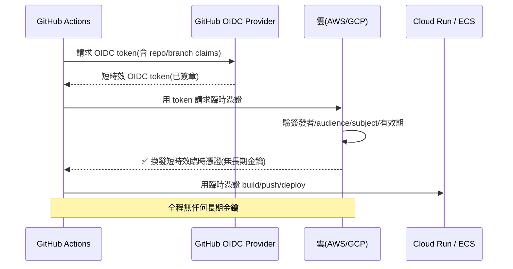

# CI/CD 上雲(OIDC 免金鑰)

> [Part 19 雲原生講過 CI/CD 的原理](../19-cloud-native/README.md)(test → build → deploy 的自動化管線)。這章把它**接到雲**:GitHub Actions 如何**build 映像、推 registry、部署到 Cloud Run/ECS**,而最關鍵的一題是——**CI 怎麼安全地取得雲的部署權限?** 舊做法是把長期 access key 存進 CI secret,但那是**外洩重災區**。現代做法是 **OIDC 聯合身分(federation)免金鑰**:CI 用短時效 token 換取雲的臨時憑證,**完全不存任何長期金鑰**。這章講清楚部署管線、OIDC 的運作與為何它更安全,並用 Python 實作一個 OIDC 信任驗證器。

## 💡 白話導讀(建議先讀)

[Part 19 講過 CI/CD 的原理](../19-cloud-native/05-ci-cd.md)(test → build → deploy 流水線)。
這章把它**真正接上雲**:讓每次 `git push` 自動測試、建映像、部署到 Cloud Run/ECS——
從此上線是「推一個 commit」的事,而不是某人半夜手動操作的驚險儀式。

典型的雲部署管線(以 GitHub Actions 為例):

```text
git push → CI 觸發
  ├─ test:  pytest / ruff / mypy(不過就停,壞碼進不了)
  ├─ build: docker build
  ├─ auth:  【換取雲的臨時憑證】← 本章的靈魂
  ├─ push:  推映像到 ECR / Artifact Registry
  └─ deploy: 部署到 Cloud Run / ECS
```

這章的**核心重點**,是那個 auth 步驟背後的觀念——**OIDC 免金鑰部署**,
它是 [ch02「用角色別用金鑰」](02-iam.md)的最漂亮實踐:

**老做法(危險)**:在雲上產生一把永久 access key,塞進 GitHub secrets——
這把萬能鑰匙一旦外洩(GitHub 被駭、設定失誤),攻擊者就能長驅直入你的雲帳號。
而且沒人記得輪替它。

**新做法(OIDC 聯合身分)**:GitHub Actions 和雲**建立信任關係**,
每次部署時,GitHub 出示一張「我真的是你信任的那個 repo 的 workflow」的**臨時身分證**,
雲驗證後發一組**幾分鐘就過期的臨時憑證**——
**全程沒有任何長期金鑰存在**,自然沒有金鑰可洩漏。

這章帶你寫出完整的 GitHub Actions 部署 workflow、設定 OIDC 信任、
配合 [Terraform](08-iac-terraform.md) 做基礎設施的 CI/CD,
並加上部署的安全網:**冒煙測試、自動回滾**。這是讓團隊能安心、頻繁上線的關鍵基建。

## Why(為什麼)

把應用自動部署上雲,最危險的一環是**「CI 憑什麼能動你的雲?」**:

- **長期金鑰存 CI secret 是外洩重災區**:傳統做法把 AWS access key / GCP service account key 存進 GitHub Secrets。問題是——這是**長期有效的憑證**,一旦洩漏(被 fork PR 竊取、被惡意 action 讀走、被誤印進 log),攻擊者就能**長期存取你的雲**。CI 系統是攻擊者的高價值目標。
- **金鑰難輪替、易遺忘**:存在 CI 的金鑰常常**設了就忘**,幾年不換;要輪替得記得同步更新——摩擦大到大家乾脆不換。
- **手動部署不可重現、易出錯**:SSH 上去 `docker pull && restart`、手動點 console 部署——**沒有測試門檻、沒有記錄、無法回滾**。CI/CD 讓部署**自動、一致、可追溯、可回滾**。
- **部署要有品質門檻**:直接把沒測過的 code 推上線是災難。CI/CD 在部署前**強制跑測試/lint/型別檢查/[eval gate](../30-production-ai/README.md)**——不過就不部署。

**OIDC 免金鑰是這章的核心**:讓 CI **不持有任何長期雲憑證**,改用「**CI 平台簽發的短時效身分 token** → 雲驗證信任後換發**臨時憑證**」。**沒有長期金鑰可洩漏**——這是近年雲部署安全的重大進步,也是面試高頻題。

## Theory(理論:部署管線 + OIDC 聯合身分)

**典型的雲部署管線(GitHub Actions → 雲)**:

```text
push/PR ──> CI 觸發
   ├─ test:pytest / ruff / mypy(不過就停)
   ├─ build:docker build
   ├─ auth:【OIDC 換臨時憑證】← 本章重點
   ├─ push:推映像到 ECR / Artifact Registry
   └─ deploy:更新 Cloud Run / ECS service
              └─ 可加金絲雀 / 流量切換 / 自動回滾
```

**OIDC 聯合身分(federation)——免金鑰的原理**:

```text
傳統(有金鑰):
  CI 存長期 access key ──直接用──> 雲(金鑰洩漏 = 長期淪陷)

OIDC(免金鑰):
  1. CI 平台(GitHub)簽發一個短時效 OIDC token,
     內含 claims:誰(repo)、哪個 branch、哪個 workflow
  2. CI 拿這個 token 向雲請求:「請給我臨時憑證」
  3. 雲檢查:這個 token 的簽發者我信任嗎?claims 符合我設的條件嗎?
     (例:只有 myorg/task-api 的 main branch 可以)
  4. 通過 → 雲換發【短時效臨時憑證】(幾十分鐘就過期)
  5. CI 用臨時憑證部署,結束即失效
  → 全程沒有任何長期金鑰
```

**核心洞見**:把「CI 持有金鑰」換成「**雲信任 CI 平台的身分簽發**」——信任關係設一次,之後 CI 每次跑都**即時換發短命憑證**。沒有靜態秘密可偷。

## Specification(規範:AWS ↔ GCP 的 OIDC 設定)

| 面向 | AWS | GCP |
|------|-----|-----|
| **機制** | IAM OIDC Identity Provider + `AssumeRoleWithWebIdentity` | Workload Identity Federation |
| **信任對象** | GitHub OIDC provider(`token.actions.githubusercontent.com`) | 同上,設為 workload identity pool |
| **換發的憑證** | 臨時 STS 憑證 | 臨時 access token(impersonate SA) |
| **條件限制** | IAM Role 的 trust policy 限定 `sub`/`repo`/`ref` | attribute condition 限定 repo/branch |
| **CI 端 action** | `aws-actions/configure-aws-credentials` | `google-github-actions/auth` |

**GitHub Actions 工作流示意(GCP,免金鑰)**:

```yaml
permissions:
  id-token: write   # 允許 GitHub 簽發 OIDC token(關鍵!)
  contents: read
jobs:
  deploy:
    runs-on: ubuntu-latest
    steps:
      - uses: actions/checkout@v4
      - uses: google-github-actions/auth@v2
        with:                     # 沒有任何金鑰,只有信任設定
          workload_identity_provider: projects/123/.../providers/github
          service_account: deployer@my-project.iam.gserviceaccount.com
      - run: gcloud run deploy task-api --source . --region asia-east1
```

**信任條件的重要性**:雲端要設**嚴格的信任條件**——例如「只有 `myorg/task-api` 這個 repo 的 `main` branch 能換到 prod 部署權限」。否則任何能拿到 GitHub OIDC token 的 repo 都可能濫用。**限定 repo + branch(+ environment)是 OIDC 安全的關鍵**。

## Implementation(底層:OIDC token 的信任驗證)

**雲端如何驗證 OIDC token(免金鑰的信任建立)**:當 CI 拿 OIDC token 來換憑證,雲執行這些檢查:

1. **驗簽發者(issuer)**:token 的 `iss` 是不是我信任的 provider(`token.actions.githubusercontent.com`)?
2. **驗簽章**:用 provider 公開的金鑰(JWKS)驗證 token 沒被偽造/竄改。
3. **驗 audience(`aud`)**:token 是簽給我這個雲/受眾的嗎?(防 token 被挪用到別處)
4. **驗 claims 條件**:`sub`/`repo`/`ref` 符合我設的條件嗎?(例:`repo:myorg/task-api:ref:refs/heads/main`)
5. **驗有效期**:token 沒過期(短時效,通常幾分鐘)。

**全部通過** → 換發臨時憑證。**任一不符** → 拒絕。**這就是「信任」的具體內容**——不是共享秘密,而是**可驗證的身分聲明 + 嚴格條件**。

**為何這比長期金鑰安全**(面試核心):

- **無靜態秘密**:沒有長期金鑰存在 CI,**無物可偷**;就算 CI log 被看光也沒有可重用的憑證。
- **短時效**:換發的臨時憑證幾十分鐘過期,洩漏窗口極小。
- **強綁定條件**:憑證只發給**特定 repo + branch + workflow**,攻擊者即使在別的 repo 也拿不到。
- **可稽核**:每次換發都有記錄(誰、哪個 workflow、何時)。

下面用 Python 實作一個 OIDC 信任驗證器,呈現雲端「驗 claims + 條件」的判斷邏輯。

## Code Example(可執行的 Python 範例)

```python
# oidc.py — 模擬雲端對 CI OIDC token 的信任驗證(純標準庫)
from __future__ import annotations

import time
from dataclasses import dataclass


@dataclass(frozen=True)
class OIDCToken:
    iss: str          # 簽發者
    aud: str          # 受眾
    sub: str          # 主體,如 "repo:myorg/task-api:ref:refs/heads/main"
    exp: float        # 過期時間(epoch 秒)


@dataclass(frozen=True)
class TrustPolicy:
    """雲端設定的信任條件(免金鑰的核心)。"""
    trusted_issuer: str
    expected_audience: str
    allowed_sub_prefix: str   # 只信符合此前綴的 subject


def verify_token(token: OIDCToken, policy: TrustPolicy,
                 now: float | None = None) -> tuple[bool, str]:
    """雲端驗證流程:通過才換發臨時憑證。回 (是否通過, 原因)。"""
    now = time.time() if now is None else now
    if token.iss != policy.trusted_issuer:
        return False, f"簽發者不受信任: {token.iss}"
    if token.aud != policy.expected_audience:
        return False, f"audience 不符: {token.aud}"
    if not token.sub.startswith(policy.allowed_sub_prefix):
        return False, f"subject 不符合條件: {token.sub}"
    if token.exp < now:
        return False, "token 已過期"
    return True, "通過 -> 換發短時效臨時憑證"


def main() -> None:
    policy = TrustPolicy(
        trusted_issuer="https://token.actions.githubusercontent.com",
        expected_audience="sts.amazonaws.com",
        allowed_sub_prefix="repo:myorg/task-api:ref:refs/heads/main",
    )
    now = 1_000_000.0

    tokens = {
        "正牌 main 部署": OIDCToken(
            iss="https://token.actions.githubusercontent.com",
            aud="sts.amazonaws.com",
            sub="repo:myorg/task-api:ref:refs/heads/main", exp=now + 300),
        "別的 repo 冒用": OIDCToken(
            iss="https://token.actions.githubusercontent.com",
            aud="sts.amazonaws.com",
            sub="repo:attacker/evil:ref:refs/heads/main", exp=now + 300),
        "feature 分支(非 main)": OIDCToken(
            iss="https://token.actions.githubusercontent.com",
            aud="sts.amazonaws.com",
            sub="repo:myorg/task-api:ref:refs/heads/dev", exp=now + 300),
        "過期 token": OIDCToken(
            iss="https://token.actions.githubusercontent.com",
            aud="sts.amazonaws.com",
            sub="repo:myorg/task-api:ref:refs/heads/main", exp=now - 10),
    }

    for name, tok in tokens.items():
        ok, reason = verify_token(tok, policy, now=now)
        mark = "ALLOW" if ok else "DENY "
        print(f"  [{mark}] {name}: {reason}")


if __name__ == "__main__":
    main()
```

**預期輸出**:

```pycon
$ python oidc.py
  [ALLOW] 正牌 main 部署: 通過 -> 換發短時效臨時憑證
  [DENY ] 別的 repo 冒用: subject 不符合條件: repo:attacker/evil:ref:refs/heads/main
  [DENY ] feature 分支(非 main): subject 不符合條件: repo:myorg/task-api:ref:refs/heads/dev
  [DENY ] 過期 token: token 已過期
```

逐段解說:

- **`TrustPolicy` 就是雲端設的信任條件**:信任哪個簽發者、期望的 audience、允許哪些 subject 前綴。**這份 policy 設定一次**,取代了「存一把長期金鑰」——之後 CI 每次來都按它驗。
- **`verify_token` 的四道檢查**:簽發者 → audience → subject 條件 → 有效期。**正牌 main 部署**四項全過 → 換發臨時憑證;**別的 repo 冒用**卡在 subject 前綴(它是 `attacker/evil`,不符 `myorg/task-api`);**feature 分支**卡在 branch 不是 `main`(prod 部署只信 main);**過期 token** 卡在有效期。
- **安全性的體現**:即使攻擊者能觸發自己 repo 的 workflow 拿到合法簽章的 GitHub OIDC token,**subject 條件也擋住他**——他的 `sub` 不是你的 repo。**這就是為什麼限定 repo + branch 是關鍵**。而且沒有任何長期金鑰在這流程裡——無物可偷。
- **要點**:OIDC 免金鑰用「可驗證身分聲明 + 嚴格條件」取代「共享長期秘密」;雲端驗簽發者/audience/subject/有效期後換發**短時效臨時憑證**;限定 repo+branch 防冒用。

## Diagram(圖解:OIDC 免金鑰部署)



## Best Practice(最佳實踐)

- **用 OIDC 聯合身分,絕不存長期雲金鑰**:CI 換臨時憑證,無靜態秘密可洩漏。
- **信任條件限定到 repo + branch(+ environment)**:prod 部署只信 main + protected environment,防冒用。
- **部署前強制品質門檻**:test/lint/型別/[eval](../30-production-ai/README.md) 不過就不部署。
- **最小權限的部署身分**:CI 換到的 role 只給部署所需權限,別給管理員。
- **版本化映像 tag + 可回滾**:用 commit SHA 當 tag,壞了切回上一版。
- **金絲雀 / 流量切換**:新版先給小流量,觀察無誤再放大([ch03/ch10](10-observability-cost.md))。
- **保護 prod 部署**:用 GitHub Environments + required reviewers 加人工審批門。
- **IaC 也走同一管線**:Terraform plan 在 PR、apply 在合併後([ch08](08-iac-terraform.md))。
- **祕密掃描**:CI 掃 code 防誤commit金鑰([ch07](07-secrets-config-network.md))。

## Common Mistakes(常見誤解)

- **把長期 access key 存 CI secret**:外洩重災區;改用 OIDC 免金鑰。
- **OIDC 信任條件太寬**:沒限定 repo/branch,任何 repo 的 token 都能濫用;必須嚴格限定 subject。
- **忘了設 `id-token: write` 權限**:GitHub 不會簽發 OIDC token,auth 失敗。
- **部署身分權限過大**:給 CI 管理員權限,一旦被濫用損害巨大;最小權限。
- **沒有品質門檻直接部署**:把沒測過的 code 推上線;test/lint 要當 gate。
- **用 `latest` tag 無法回滾**:出事切不回去;用不可變 SHA tag。
- **prod 部署無審批/無金絲雀**:一鍵全量上線,炸了就全炸;加審批 + 金絲雀。
- **以為 OIDC 很難設所以繼續用金鑰**:設定信任是一次性成本,遠低於金鑰外洩的代價。

## Interview Notes(面試重點)

- **能講雲部署管線**:test→build→auth→push registry→deploy,含品質門檻與回滾/金絲雀。
- **(必答)能講 OIDC 免金鑰**:CI 用短時效身分 token 換雲的臨時憑證,**不存長期金鑰**;取代 access key 存 secret。
- **能講雲端驗證什麼**:簽發者、audience、subject(repo+branch)條件、有效期;通過才換發臨時憑證。
- **能講為何更安全**:無靜態秘密可偷、短時效、強綁定 repo/branch、可稽核。
- **能講信任條件要嚴**:限定 repo + branch + environment,防別的 repo 冒用。
- **能對照 AWS/GCP**:AssumeRoleWithWebIdentity + OIDC provider vs Workload Identity Federation。
- **能連到最小權限**:換到的部署身分只給必要權限([ch02](02-iam.md))。

---

➡️ 下一章:[可觀測性與成本管理](10-observability-cost.md)

[⬆️ 回 Part 31 索引](README.md)
