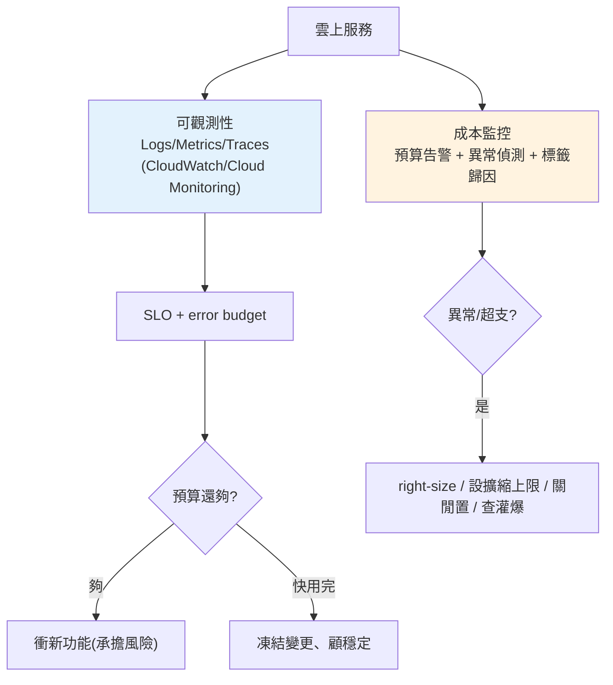

# 可觀測性與成本管理

> 服務上線後,兩個問題會立刻找上你:「**它現在好不好?**」(可觀測性)和「**這個月要花多少?**」(成本)。[Part 17 教過可觀測性的原理](../17-observability/README.md)(logs/metrics/traces、SLO、p95)——這章把它落到**雲平台**:雲怎麼幫你收集監控、怎麼設告警、以及雲獨有的痛點——**成本會失控**。按用量計費是雙面刃:彈性,但一個沒設上限的自動擴縮、忘了關的資源、或被灌爆的流量,帳單會爆。這章講雲的可觀測性工具、成本模型與省錢策略,並用 Python 實作 SLO/error budget 與成本異常偵測。

## Why(為什麼)

「上線就沒事了」是幻覺——雲上營運有兩個持續的責任:

- **看不見就無法營運**:服務變慢、錯誤率上升、某個實例掛了——**沒有可觀測性你根本不知道**,等使用者抱怨就太遲。雲平台內建監控(CloudWatch / Cloud Monitoring),你要**用它設好指標、儀表板、告警**,把問題在爆發前抓出來。
- **雲成本會失控,且常常悄悄地**:這是雲**特有**的痛。傳統機房固定成本,雲是**變動成本**——自動擴縮開太多實例、忘了關的測試環境、資料傳輸費(egress)、把大檔案放錯儲存類別、被 DDoS/爬蟲灌爆……**帳單月底才嚇到你**。理解成本模型、設預算告警,是雲工程師的基本責任。
- **可靠性要量化,不能靠感覺**:「服務還算穩」不是工程語言。**SLO(服務等級目標)+ error budget(錯誤預算)** 把可靠性變成可測量、可決策的數字——還剩多少預算決定「該衝新功能還是該穩定性」。
- **成本與可靠性要平衡**:一味追求高可用會很貴(多可用區、過度備援、min instances 全開);一味省錢會不穩。**用數據在兩者間做取捨**,而非拍腦袋。

**核心心法**:**上線是營運的開始,不是結束**。用可觀測性看見狀態、用 SLO 量化可靠性、用成本監控避免帳單爆炸。這章補齊「服務活著之後」的功課。

## Theory(理論:可觀測性三支柱 + SLO + 成本模型)

**可觀測性三支柱**(承 [Part 17](../17-observability/README.md),雲上一樣適用):

```text
Logs    發生了什麼(離散事件、除錯細節)
Metrics 量化趨勢(延遲/QPS/錯誤率/資源使用,可告警)
Traces  一個請求跨服務的完整路徑(定位瓶頸)
        ↑ 雲平台:CloudWatch / Cloud Monitoring 自動收集 + 告警
```

**SLI / SLO / error budget**(把可靠性變數字):

- **SLI(指標)**:實際測到的可靠性數字,如「成功請求比例 99.95%」、「p95 延遲 180ms」。
- **SLO(目標)**:你承諾的目標,如「可用性 ≥ 99.9%」。
- **error budget(錯誤預算)**:`1 − SLO`。99.9% SLO → **0.1% 的失敗預算**(約每月 43 分鐘)。**還有預算 → 可以衝新功能承擔風險;預算快用完 → 該專注穩定性**。這是把可靠性與開發節奏連動的機制。

**雲成本模型**(為何會失控):

```text
成本 = 運算(實例規格 × 時間 / 呼叫數)
     + 儲存(GB × 儲存類別單價)
     + 資料傳輸(egress 出雲/跨區,常被忽略!)
     + 託管服務(DB 實例、負載平衡器、NAT gateway...)
     + 請求數(API/物件儲存操作)
```

**最常見的爆帳原因**:忘了關的資源、自動擴縮無上限、egress 傳輸費、選錯儲存類別、DB 規格過大、被惡意流量灌爆。

## Specification(規範:AWS ↔ GCP 可觀測性與成本工具)

| 類別 | AWS | GCP |
|------|-----|-----|
| **指標/監控** | CloudWatch Metrics | Cloud Monitoring |
| **日誌** | CloudWatch Logs | Cloud Logging |
| **追蹤** | X-Ray | Cloud Trace |
| **告警** | CloudWatch Alarms | Monitoring Alerting |
| **儀表板** | CloudWatch Dashboards | Monitoring Dashboards |
| **成本檢視** | Cost Explorer | Cost Management / Billing Reports |
| **預算告警** | AWS Budgets | Budgets & Alerts |
| **成本分攤** | Cost Allocation Tags | Labels |
| **標準協定** | OpenTelemetry(兩雲皆支援) | OpenTelemetry |

**OpenTelemetry(OTel)——可攜的可觀測性**:與其綁定單一雲的 SDK,用 **OTel** 這個廠商中立標準來 instrument 你的應用(產生 logs/metrics/traces),再匯出到任一後端(CloudWatch/Cloud Monitoring/Datadog…)。**降低廠商鎖定**,呼應 [Part 17](../17-observability/README.md)。

**成本分攤標籤(tag/label)——歸因的關鍵**:給每個資源打標籤(`team`、`env`、`service`),帳單就能**按團隊/環境/服務分組**——才知道錢花在哪、哪個服務要優化。**沒打標籤 = 帳單是一團無法拆解的數字**。

## Implementation(底層:error budget 計算與成本告警)

**error budget 怎麼驅動決策**:假設 SLO 99.9%,一個月約 43 分鐘的失敗預算。監控**累計消耗**:

- **消耗速率正常**:還有預算 → 可以承擔部署新功能的風險。
- **消耗過快(burn rate 高)**:如一天燒掉整月預算的一半 → **觸發告警、凍結風險性變更、專注止血**。
- **預算耗盡**:停止非必要變更,全力恢復可靠性。

**burn rate(燃燒率)告警比「單看錯誤率」更好**:它衡量「以目前速率,預算多快會用完」——**快速燃燒(短時間大量失敗)** 和**慢速燃燒(持續小量失敗)** 用不同閾值告警,兼顧「立即重大故障」與「緩慢惡化」。

**成本異常偵測**:不能等月底看帳單。做法:

- **預算 + 告警**:設月預算,達 50%/80%/100% 發告警(AWS Budgets / GCP Budgets)。
- **異常偵測**:比對「今日花費 vs 近期基線」,突增就告警(可能是失控擴縮或被灌爆)。
- **成本歸因**:用標籤按服務/團隊分組,定位異常來源。

**省錢策略**(在可靠性允許下):合適規格(right-sizing,別過度配置)、自動擴縮設**上限**、閒置資源自動關閉(非 prod 下班關機)、選對儲存類別(冷資料降級)、用 committed use / savings plan(長期承諾換折扣)、減少跨區/egress 傳輸、快取降低重複運算。下面用 Python 實作 error budget 與成本異常偵測。

## Code Example(可執行的 Python 範例)

```python
# observability_cost.py — SLO/error budget + 成本異常偵測(純標準庫)
from __future__ import annotations

from dataclasses import dataclass


def error_budget_status(slo: float, total_requests: int,
                        failed_requests: int) -> dict[str, float]:
    """計算 error budget 消耗狀況。slo 如 0.999。"""
    budget_fraction = 1 - slo                      # 允許失敗比例
    allowed_failures = total_requests * budget_fraction
    actual_fraction = failed_requests / total_requests if total_requests else 0
    consumed = (failed_requests / allowed_failures) if allowed_failures else 0
    return {
        "允許失敗數": round(allowed_failures, 1),
        "實際失敗數": float(failed_requests),
        "實際失敗率%": round(actual_fraction * 100, 4),
        "預算消耗%": round(consumed * 100, 1),
        "達標": float(failed_requests <= allowed_failures),  # 1=達標
    }


@dataclass
class CostAlert:
    threshold_pct: float   # 相對基線超出多少 % 就告警


def detect_cost_anomaly(baseline_daily: float, today: float,
                        alert: CostAlert) -> tuple[bool, float]:
    """比對今日花費與基線,超出閾值則告警。"""
    if baseline_daily <= 0:
        return False, 0.0
    increase_pct = (today - baseline_daily) / baseline_daily * 100
    return increase_pct > alert.threshold_pct, round(increase_pct, 1)


def main() -> None:
    print("Error budget(SLO=99.9%,本月 1,000,000 請求):")
    for failed in (500, 1000, 2500):
        s = error_budget_status(slo=0.999, total_requests=1_000_000,
                                failed_requests=failed)
        status = "達標" if s["達標"] else "超標!"
        print(f"  失敗 {failed}: 消耗預算 {s['預算消耗%']}% "
              f"(允許 {s['允許失敗數']:.0f}) -> {status}")

    print("\n成本異常偵測(基線 $100/日, 超出 50% 告警):")
    alert = CostAlert(threshold_pct=50.0)
    for today in (110.0, 180.0, 320.0):
        fire, inc = detect_cost_anomaly(100.0, today, alert)
        mark = "🚨 告警" if fire else "正常"
        print(f"  今日 ${today}: 較基線 {inc:+.1f}% -> {mark}")


if __name__ == "__main__":
    main()
```

**預期輸出**:

```pycon
$ python observability_cost.py
Error budget(SLO=99.9%,本月 1,000,000 請求):
  失敗 500: 消耗預算 50.0% (允許 1000) -> 達標
  失敗 1000: 消耗預算 100.0% (允許 1000) -> 達標
  失敗 2500: 消耗預算 250.0% (允許 1000) -> 超標!

成本異常偵測(基線 $100/日, 超出 50% 告警):
  今日 $110.0: 較基線 +10.0% -> 正常
  今日 $180.0: 較基線 +80.0% -> 🚨 告警
  今日 $320.0: 較基線 +220.0% -> 🚨 告警
```

逐段解說:

- **`error_budget_status`**:SLO 99.9% → 允許失敗比例 0.1% → 100 萬請求允許 **1000 次失敗**。失敗 500 = 消耗 50% 預算(還有一半可承擔風險）;失敗 1000 = 剛好用完;失敗 2500 = **消耗 250%,嚴重超標**。**「消耗預算%」把可靠性變成一個可決策的數字**——超過某個燃燒速率就該凍結變更。
- **為何用「預算消耗%」而非只看失敗率**:0.25% 失敗率聽起來很小,但相對 0.1% 的 SLO 是**超標 2.5 倍**——**用預算為基準才看得出嚴重性**。這正是 SLO 思維的價值。
- **`detect_cost_anomaly`**:比對今日 vs 基線,超出閾值告警。$180(+80%)和 $320(+220%)都觸發——**在月底帳單之前就發現異常**(可能是失控擴縮或被爬蟲灌爆)。這比「月底才看帳單」早太多。
- **實務串接**:真實系統把這些接到 CloudWatch/Cloud Monitoring 的 metric + alarm、AWS Budgets/GCP Budgets 的預算告警,並用標籤歸因到服務。這裡的函式是那些告警規則的**判斷核心**。
- **要點**:可觀測性三支柱看見狀態;SLO + error budget 把可靠性量化並驅動「衝功能 vs 顧穩定」的決策;雲成本會失控,要用預算 + 異常偵測 + 標籤歸因主動管理。

## Diagram(圖解:營運閉環)



## Best Practice(最佳實踐)

- **上線即設好監控與告警**:關鍵指標(延遲 p95/p99、錯誤率、飽和度)+ 告警,別等使用者回報。
- **用 SLO + error budget 量化可靠性**:以預算消耗/burn rate 驅動「衝功能 vs 顧穩定」的決策。
- **用 burn rate 告警**:快/慢燃燒不同閾值,兼顧重大故障與緩慢惡化。
- **設預算 + 成本異常告警**:達 50/80/100% 告警、今日 vs 基線突增告警;別等月底帳單。
- **打標籤做成本歸因**:按 team/env/service 分組,知道錢花在哪、誰要優化。
- **right-size + 擴縮設上限**:別過度配置;自動擴縮一定要有上限防失控。
- **關閉閒置資源**:非 prod 下班關機、刪未用資源;egress/儲存類別也要顧。
- **用 OpenTelemetry 保可攜**:廠商中立 instrument,匯出到任一後端。
- **長期承諾換折扣**:穩定基載用 savings plan / committed use。

## Common Mistakes(常見誤解)

- **上線不設監控告警**:出事靠使用者回報,反應永遠慢半拍。
- **自動擴縮不設上限**:流量暴衝或被灌爆時實例狂開,帳單爆炸。
- **忘了關測試/臨時資源**:閒置資源持續計費,月底才發現。
- **忽略 egress/資料傳輸費**:出雲/跨區傳輸常是隱形大宗成本。
- **不打標籤**:帳單無法拆解,不知道錢花在哪、無法歸因優化。
- **只看平均延遲**:被長尾掩蓋;看 p95/p99([Part 17](../17-observability/README.md))。
- **把 SLO 訂成 100%**:不切實際且極貴;留 error budget 才能兼顧創新。
- **等月底看帳單**:太遲;要即時預算告警 + 異常偵測。
- **過度追求高可用**:每多一個 9 成本跳升;依實際需求定 SLO。

## Interview Notes(面試重點)

- **能講可觀測性三支柱在雲上落地**:CloudWatch/Cloud Monitoring 收集 logs/metrics/traces + 告警;OTel 保可攜。
- **能講 SLI/SLO/error budget**:SLO=目標、error budget=1−SLO;用預算消耗/burn rate 驅動開發節奏決策。
- **能講 burn rate 告警為何優於單看錯誤率**:衡量「多快用完預算」,快/慢燃燒分別告警。
- **能講雲成本為何會失控**:變動成本 + 自動擴縮無上限 + 忘關資源 + egress + 選錯儲存;要預算告警 + 異常偵測 + 標籤歸因。
- **能講省錢策略**:right-size、擴縮上限、關閒置、儲存類別、committed use、減 egress、快取。
- **能對照 AWS/GCP**:CloudWatch/Cloud Monitoring、X-Ray/Cloud Trace、AWS Budgets/GCP Budgets、tags/labels。
- **能講成本與可靠性的取捨**:用數據平衡,別一味追高可用或一味省錢。

---

➡️ 下一章:[🏗️ Capstone:task-api 端到端上雲](11-capstone-deploy.md)

[⬆️ 回 Part 31 索引](README.md)
