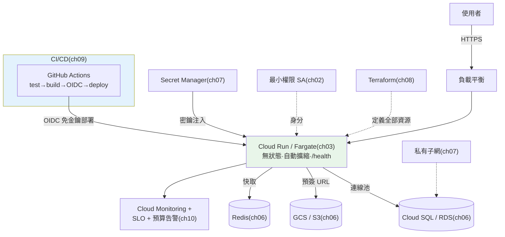

# 🏗️ Capstone:task-api 端到端上雲

> 這是 Part 31 的收尾,也是**全書實戰專案 [task-api](../../project/) 的部署終章**。前十章各講一塊拼圖(IAM、容器、DB/儲存、密鑰、IaC、CI/CD、可觀測性),這章把它們**組裝成一條完整的上雲路徑**:從一個 [FastAPI](../14-web/README.md) 容器,到一個**自動部署、有狀態外置、密鑰安全、免金鑰 CI、可觀測、成本可控**的線上服務。我們以 **Cloud Run(GCP)為主線** 走一遍,並標註 **AWS 對應**。這章不引入新概念,而是把前面所有章**串成一張架構圖與一份部署檢查清單**,並用 Python 實作一個「端到端部署就緒度」總驗收。

## Why(為什麼)

單獨會每一塊還不夠——**上雲的難點在「把它們正確地組起來」**:

- **一個環節錯,整條鏈斷**:DB 忘了放私有子網、密鑰寫死、CI 用了長期金鑰、擴縮沒設上限……**任一環節的疏漏都會變成資安漏洞或帳單災難**。這章給你一份**端到端檢查清單**,確保每塊都到位。
- **要看見「全貌」而非零件**:面試官問「你會怎麼把一個 Python 服務部署上雲?」,考的是**你腦中有沒有完整架構**——運算在哪、狀態在哪、憑證怎麼流、CI 怎麼安全部署、上線後怎麼看。這章就是那張全貌圖。
- **task-api 是全書縮影**:它用到 [FastAPI](../14-web/README.md)、[分層架構](../16-architecture/README.md)、[DB](../13-database/README.md)、[async](../11-concurrency-async/README.md)、[測試](../15-testing-tooling/README.md)、[可觀測性](../17-observability/README.md)——把它成功部署上雲,等於驗證你**從寫程式到營運的完整能力**。
- **從「能跑」到「生產級」的差距**:本機 `uvicorn` 能跑,離「生產級雲服務」還有一大段——這章明確標出那段差距,讓你知道還缺什麼。

**核心心法**:**把前十章組裝成一條無縫的路徑**,每個決策都有前面章節的依據。這是你上雲能力的總驗收。

## Theory(理論:端到端架構全貌)

把 task-api 部署上雲的**完整架構**(以 Cloud Run 為主線):

```text
                    ┌──────────── CI/CD(GitHub Actions)────────────┐
   git push ──────> │ test(pytest/ruff/mypy)→ build → [OIDC 免金鑰]│
                    │ → push Artifact Registry → deploy Cloud Run    │  ch09
                    └───────────────────────┬────────────────────────┘
                                            │ 部署
   使用者 ──HTTPS──> [負載平衡] ──> ┌─────────────────────┐
                                    │  Cloud Run(task-api)│  ch03
                                    │  無狀態、自動擴縮     │
                                    │  讀 $PORT、/health    │
                                    └──────────┬──────────┘
                       密鑰引用注入 │          │ 私有連線
              (Secret Manager)ch07 │          ├──> Cloud SQL(任務資料)ch06
                                    │          ├──> GCS(附件,預簽 URL)ch06
       身分:專屬 Service Account   │          └──> Memorystore(快取)ch06
       最小權限 ch02 ───────────────┘
                                    全部由 Terraform 定義 ch08
                                    Cloud Monitoring 監控 + 預算告警 ch10
```

**AWS 對應**:Cloud Run→**ECS/Fargate**、Artifact Registry→**ECR**、Cloud SQL→**RDS**、GCS→**S3**、Memorystore→**ElastiCache**、Secret Manager→**Secrets Manager**、Cloud Monitoring→**CloudWatch**、OIDC→**AssumeRoleWithWebIdentity**。**架構相同,服務名對映**——這正是 [ch01 對照表](01-cloud-overview.md) 的價值。

## Specification(規範:端到端部署檢查清單)

把前十章濃縮成一份**上線前檢查清單**(每項標註對應章節):

**運算與容器([ch03](03-containers-ecs-cloudrun.md))**
- [ ] 服務無狀態(狀態全外置)
- [ ] 讀 `$PORT`、提供 `/health`
- [ ] 版本化映像 tag(commit SHA,非 latest)
- [ ] 自動擴縮設**上限**、視延遲需求設 min instances

**狀態([ch06](06-managed-db-storage.md))**
- [ ] 任務資料 → Cloud SQL/RDS,用**連線池 / pooler**
- [ ] 附件 → GCS/S3,用**預簽 URL** 直傳
- [ ] 快取/session → Redis
- [ ] 備份/PITR 已開啟並**演練過還原**

**安全([ch02](02-iam.md) / [ch07](07-secrets-config-network.md))**
- [ ] 服務掛**專屬 Service Account/Role**,最小權限
- [ ] 密鑰在 Secret Manager,設定裡只放**引用**,無明文
- [ ] DB/快取在**私有子網**、無公網 IP
- [ ] 安全群組/防火牆只開必要埠

**IaC 與 CI/CD([ch08](08-iac-terraform.md) / [ch09](09-cicd-to-cloud.md))**
- [ ] 所有資源由 **Terraform** 定義,state 遠端 + 鎖
- [ ] CI 用 **OIDC 免金鑰**,信任限定 repo + branch
- [ ] 部署前**品質門檻**(test/lint/型別)不過不部署
- [ ] 可回滾(版本化)+ prod 部署有審批/金絲雀

**營運([ch10](10-observability-cost.md))**
- [ ] 監控關鍵指標 + 告警(p95、錯誤率)
- [ ] SLO + error budget 已定義
- [ ] 預算告警 + 成本異常偵測 + 資源打標籤

## Implementation(底層:一次部署的完整資料流)

**追一次「push 到上線」的完整流程**,看每章如何接力:

1. **開發者 `git push`** → 觸發 GitHub Actions([ch09](09-cicd-to-cloud.md))。
2. **CI 跑品質門檻**:`pytest`/`ruff`/`mypy`([Part 15](../15-testing-tooling/README.md))——不過就停,不部署。
3. **build 映像**:多階段 Docker build,slim image([ch03](03-containers-ecs-cloudrun.md))。
4. **OIDC 換臨時憑證**:GitHub OIDC token → 雲驗證 repo+branch → 換發**短時效憑證**,**無長期金鑰**([ch09](09-cicd-to-cloud.md))。
5. **push 到 Artifact Registry / ECR**,tag = commit SHA。
6. **deploy Cloud Run / ECS**:新版拉映像啟動,**密鑰從 Secret Manager 注入**成環境變數([ch07](07-secrets-config-network.md)),服務掛**專屬最小權限 SA**([ch02](02-iam.md))。
7. **健康檢查通過** → 流量切到新版(可金絲雀漸進)([ch03](03-containers-ecs-cloudrun.md))。
8. **服務運行**:無狀態,任務讀寫 **Cloud SQL(經連線池)**、附件走 **GCS 預簽 URL**、快取用 **Redis**——全在**私有網路**([ch06](06-managed-db-storage.md)/[ch07](07-secrets-config-network.md))。
9. **持續營運**:**Cloud Monitoring** 收指標、**SLO/error budget** 追可靠性、**預算告警**防爆帳([ch10](10-observability-cost.md))。
10. **整個基礎設施由 Terraform 定義**,任何變更走 PR + plan([ch08](08-iac-terraform.md))。

**這條鏈的每一環都是前面某一章**——串起來就是「一個 Python 服務的生產級雲部署」。下面用 Python 實作端到端就緒度總驗收,把整份檢查清單變成可執行的把關。

## Code Example(可執行的 Python 範例)

```python
# capstone_deploy.py — task-api 端到端上雲就緒度總驗收(純標準庫)
from __future__ import annotations

from dataclasses import dataclass, field


@dataclass
class DeploymentPlan:
    # 容器(ch03)
    stateless: bool
    reads_port_env: bool
    health_endpoint: bool
    immutable_image_tag: bool
    autoscale_max_set: bool
    # 狀態(ch06)
    db_uses_pool: bool
    files_in_object_storage: bool
    backups_verified: bool
    # 安全(ch02/ch07)
    dedicated_least_priv_sa: bool
    secrets_via_manager: bool
    db_private_network: bool
    # IaC / CI-CD(ch08/ch09)
    terraform_managed: bool
    cicd_oidc_keyless: bool
    quality_gate_before_deploy: bool
    # 營運(ch10)
    monitoring_and_alerts: bool
    budget_alerts: bool

    checks: dict[str, bool] = field(init=False)

    def __post_init__(self) -> None:
        self.checks = {
            "ch03 無狀態": self.stateless,
            "ch03 讀 $PORT": self.reads_port_env,
            "ch03 /health": self.health_endpoint,
            "ch03 不可變映像 tag": self.immutable_image_tag,
            "ch03 擴縮設上限": self.autoscale_max_set,
            "ch06 DB 連線池": self.db_uses_pool,
            "ch06 檔案進物件儲存": self.files_in_object_storage,
            "ch06 備份已驗證": self.backups_verified,
            "ch02 專屬最小權限 SA": self.dedicated_least_priv_sa,
            "ch07 密鑰走 manager": self.secrets_via_manager,
            "ch07 DB 私有網路": self.db_private_network,
            "ch08 Terraform 管理": self.terraform_managed,
            "ch09 CI/CD OIDC 免金鑰": self.cicd_oidc_keyless,
            "ch09 部署前品質門檻": self.quality_gate_before_deploy,
            "ch10 監控與告警": self.monitoring_and_alerts,
            "ch10 預算告警": self.budget_alerts,
        }


# 安全 blocker:未通過即禁止上 prod
SECURITY_BLOCKERS = {
    "ch02 專屬最小權限 SA", "ch07 密鑰走 manager",
    "ch07 DB 私有網路", "ch09 CI/CD OIDC 免金鑰",
}


def audit(plan: DeploymentPlan) -> tuple[bool, list[str], list[str]]:
    """回 (可否上 prod, 未過項目, 其中的安全 blocker)。"""
    failed = [name for name, ok in plan.checks.items() if not ok]
    blockers = [name for name in failed if name in SECURITY_BLOCKERS]
    can_deploy = len(failed) == 0
    return can_deploy, failed, blockers


def main() -> None:
    ready = DeploymentPlan(
        stateless=True, reads_port_env=True, health_endpoint=True,
        immutable_image_tag=True, autoscale_max_set=True,
        db_uses_pool=True, files_in_object_storage=True, backups_verified=True,
        dedicated_least_priv_sa=True, secrets_via_manager=True,
        db_private_network=True, terraform_managed=True,
        cicd_oidc_keyless=True, quality_gate_before_deploy=True,
        monitoring_and_alerts=True, budget_alerts=True,
    )
    risky = DeploymentPlan(
        stateless=True, reads_port_env=True, health_endpoint=True,
        immutable_image_tag=False, autoscale_max_set=False,
        db_uses_pool=True, files_in_object_storage=True, backups_verified=False,
        dedicated_least_priv_sa=True, secrets_via_manager=False,   # blocker!
        db_private_network=False,                                  # blocker!
        terraform_managed=True, cicd_oidc_keyless=True,
        quality_gate_before_deploy=True,
        monitoring_and_alerts=True, budget_alerts=False,
    )

    for label, plan in [("就緒的部署", ready), ("有風險的部署", risky)]:
        ok, failed, blockers = audit(plan)
        print(f"\n{label}: {'✅ 可上 prod' if ok else '❌ 禁止上 prod'}")
        if failed:
            print(f"  未通過 {len(failed)} 項:")
            for f in failed:
                tag = " 🚨安全BLOCKER" if f in blockers else ""
                print(f"    - {f}{tag}")


if __name__ == "__main__":
    main()
```

**預期輸出**:

```pycon
$ python capstone_deploy.py

就緒的部署: ✅ 可上 prod

有風險的部署: ❌ 禁止上 prod
  未通過 4 項:
    - ch03 不可變映像 tag
    - ch03 擴縮設上限
    - ch06 備份已驗證
    - ch07 密鑰走 manager 🚨安全BLOCKER
    - ch07 DB 私有網路 🚨安全BLOCKER
    - ch10 預算告警
```

逐段解說:

- **`DeploymentPlan` 把整份檢查清單變成型別化欄位**:每個欄位對應前面某一章的一個要求。`__post_init__` 把它們攤成一個 `checks` 字典,方便統一稽核——**這是把「檢查清單」程式化**,能放進 CI 當上線把關。
- **`SECURITY_BLOCKERS` 的分級**:不是所有未過項目都同等嚴重。**安全類**(密鑰寫死、DB 公開、CI 用長期金鑰、過度權限)是**硬 blocker**——**絕不能上 prod**;其他(如映像 tag、預算告警)是該補但非立即致命。這對映真實團隊的「上線 gate」——**安全問題一票否決**。
- **`audit` 的判斷**:就緒的部署 16 項全過 → 可上 prod;有風險的部署 4 項未過,其中**密鑰走 manager、DB 私有網路是安全 blocker** → **禁止上 prod**,直到補齊。這就是把前十章的所有教訓**濃縮成一個可執行的守門員**。
- **與全書呼應**:這個總驗收的每一項都能追溯到某一章的「Best Practice / Common Mistakes」——把散落的知識**收斂成一份可操作的清單**。
- **要點**:端到端上雲 = 把前十章正確組裝;用檢查清單確保每環到位;安全問題是硬 blocker、一票否決;把清單程式化成 CI 的上線 gate。

## Diagram(圖解:task-api 生產級雲架構)



## Best Practice(最佳實踐)

- **用檢查清單把關上線**:把前十章要求程式化成 gate,缺一項就標出來。
- **安全問題一票否決**:密鑰寫死、DB 公開、CI 用長期金鑰、過度權限——沒補齊絕不上 prod。
- **運算無狀態、狀態放對地方、憑證走臨時**:三大主軸貫穿整條鏈。
- **全 IaC + 免金鑰 CI/CD**:基礎設施可重現、部署無靜態秘密。
- **上線即營運**:監控/告警/SLO/預算同步就位,不是事後補。
- **先簡單再複雜**:task-api 這種無狀態服務用 Cloud Run/Fargate 就好,別一開始上 K8s([ch01](01-cloud-overview.md))。
- **AWS/GCP 對照思考**:記住架構相同、服務名對映,不被單一雲綁死。
- **漸進發布**:金絲雀 + 可回滾,降低上線風險。

## Common Mistakes(常見誤解)

- **只會零件、不會組裝**:每塊都懂卻串不起來;要能畫出端到端全貌。
- **忽略某一環的安全**:DB 沒私有化、密鑰寫死、CI 用金鑰——單點疏漏毀掉整體。
- **上線才想營運**:沒監控/告警/預算,出事與爆帳都後知後覺。
- **無狀態原則沒貫徹**:某處偷存本機狀態,多實例就出錯。
- **手動部署不可重現**:沒 IaC、沒 CI/CD,環境無法一致重建。
- **簡單服務上 K8s**:過度工程;Cloud Run/Fargate 足矣。
- **沒有回滾機制**:用 latest tag、無金絲雀,出事切不回去。
- **以為「本機能跑」就等於生產級**:還差狀態外置、安全、CI/CD、可觀測、成本管理一整套。

## Interview Notes(面試重點)

- **能畫端到端架構**:CI/CD(OIDC)→ 容器(Cloud Run/Fargate,無狀態)→ 狀態(DB/物件儲存/快取)→ 安全(SA/密鑰/私有網路)→ IaC → 可觀測性/成本。
- **能追一次部署的完整資料流**:push→測試門檻→build→OIDC 換臨時憑證→push registry→deploy→密鑰注入→健康檢查→切流量→營運。
- **能講「生產級 vs 能跑」的差距**:狀態外置、安全、免金鑰 CI、可觀測、成本管理。
- **能做 AWS/GCP 對照**:整套架構在兩雲的服務對映。
- **能分辨安全 blocker**:密鑰、網路、憑證、權限問題一票否決。
- **能講選型依據**:為何 task-api 用 Cloud Run/Fargate 而非 K8s(呼應 [ch01](01-cloud-overview.md))。
- **能把前十章串成一致敘事**:這正是面試官問「你怎麼把服務部署上雲」想聽的完整回答。

---

🎉 **完成 Part 31!** 你已把全書實戰專案 task-api 從程式碼帶到**生產級雲部署**——涵蓋 AWS 與 GCP 的容器、K8s、serverless、DB/儲存、IAM、密鑰、IaC、免金鑰 CI/CD、可觀測性與成本管理。

⬅️ 相關:[Part 19 雲原生與部署](../19-cloud-native/README.md) ｜ [Part 17 可觀測性](../17-observability/README.md)

[⬆️ 回 Part 31 索引](README.md) ｜ [⬆️ 回章節總覽](../README.md)
